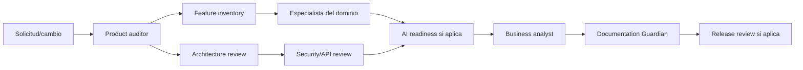

# Matriz de interacción entre agentes

Esta matriz define coordinación documental permitida; no implica que la plataforma Copilot invoque agentes automáticamente ni concede permisos de herramientas/datos.

| Solicitante/orquestador | Puede solicitar revisión a                                                              | Condición/artefacto de entrada                              | No delegar                                                                                             |
| ----------------------- | --------------------------------------------------------------------------------------- | ----------------------------------------------------------- | ------------------------------------------------------------------------------------------------------ |
| Product auditor         | Inventario de features, arquitectura, seguridad, API, planes y especialistas de dominio | Plan y corte; limitar hallazgo a evidencia y rutas.         | No pedir a especialistas cambiar fuentes propietarias ajenas; consolidar conflicto primero en brechas. |
| Feature inventory       | API, planes, salud, GPS, marketplace, municipal, growth                                 | Capacidad trazada y estado preliminar.                      | No inferir E2E de pantallas/tests no ejecutados.                                                       |
| Architecture review     | Security, API, GPS, telemedicine, AI readiness                                          | Componentes/DI y límites de datos revisados.                | No pedir despliegue/provisionamiento en una auditoría de arquitectura.                                 |
| Security audit          | AI readiness, health, GPS, telemedicine, API                                            | Activo/amenaza, endpoint y pruebas; datos redactados.       | No compartir secretos, PII, tokens o coordenadas; no afirmar compliance.                               |
| AI readiness            | Architecture, feature inventory, security, health                                       | Caso de uso, dataset/finalidad y nivel de acceso definidos. | No invocar modelo con datos reales ni habilitar diagnóstico/acciones autónomas.                        |
| Business analyst        | Feature inventory, subscription plans, domain specialists                               | Estados/evidencia de producto ya fijados.                   | No redefinir estado técnico, precios ni resultados comerciales.                                        |
| Release manager         | API, security, feature inventory, architecture                                          | Tag/rango y reportes de prueba/build verificables.          | No desplegar ni declarar release sin aprobación explícita y pruebas.                                   |
| Documentation Guardian  | Owner documental correspondiente, luego Product auditor si hay conflicto                | Cambio relevante y lista de fuentes afectadas.              | No sobrescribir documentos con propiedad distinta ni modificar código productivo.                      |

## Ruta recomendada

El flujo es una política de coordinación, no un graph de ejecución habilitado. Consentimiento, autorización y gates siguen aplicando en cada agente.
