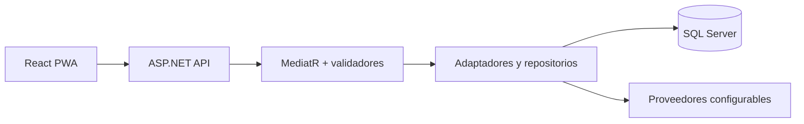

# Componentes

El diagrama representa **dependencias de código**, no estado de producción: [router UI](../../frontend/src/app/routes.tsx), [bootstrap API](../../backend/src/PawTrack.API/Program.cs), [registro Application](../../backend/src/PawTrack.Application/ApplicationServiceCollectionExtensions.cs), [registro Infrastructure](../../backend/src/PawTrack.Infrastructure/InfrastructureServiceCollectionExtensions.cs). Los módulos comparten [PawTrackDbContext](../../backend/src/PawTrack.Infrastructure/Persistence/PawTrackDbContext.cs). Los proveedores externos requieren credenciales y pruebas independientes ([Vision](../../backend/src/PawTrack.Infrastructure/AI/AzureVisionEmbeddingService.cs), [TrackSolid](../../backend/src/PawTrack.Infrastructure/Collars/TrackSolidService.cs)).
