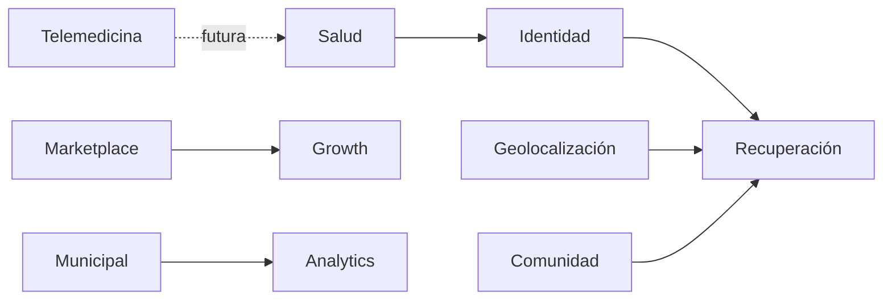

# Modelo de capacidades

Cada fila asigna las capacidades F01-F30 de la [matriz de trazabilidad](../auditoria/FEATURE_TRACEABILITY_MATRIX.md) a una capacidad primaria. La asignación es una taxonomía de negocio, no prueba de disponibilidad. Las denominaciones y estados técnicos de la matriz son autoritativos.

## Identidad

- `F01`: autenticación y MFA.
- `F02`: mascota y QR.
- `F25`: soporte y administración privilegiada.
- `F28`: cuenta familiar.

## Recuperación

- `F03`: crear reporte de pérdida.
- `F04`: cambiar estado de pérdida.
- `F05`: registrar avistamiento.
- `F14`: matching visual; proveedor externo no verificado.
- `F19`: copiloto/RAG/agentes; propuesto.
- `F20`: chat, handover y fraude; flujo no verificado E2E.

## Geolocalización

- `F06`: registrar collar; prueba a nivel handler, hardware no verificado.
- `F13`: sincronización TrackSolid; proveedor/dispositivo no verificado.
- `F21`: mapa y búsqueda coordinada; flujo multiusuario no verificado.

## Salud

- `F07`: historial médico; sin E2E en el corte.
- `F08`: clínicas, agenda y finanzas; parcial.
- `F23`: certificados y campañas; flujo no probado E2E.

## Comunidad

- `F16`: WhatsApp/directorio; proveedor externo no verificado.
- `F22`: bienestar, aliados y hogares temporales; flujo no verificado.

## Marketplace

- `F09`: adopciones.
- `F10`: pedidos de tienda, sin pago verificado.
- `F11`: servicios y reservas; pago integral parcial.
- `F24`: recompensas, bundles y facturación; no verificado.
- `F30`: widgets clínicos; integración de terceros no verificada.

## Municipal

- `F15`: capturas/reportes institucionales; parcial, envío oficial no implementado.

## Telemedicina

- `F18`: consulta remota de audio/video; declarada no implementada.

## Growth

- `F12`: suscripciones/entitlements; límites comerciales no verificados íntegramente.
- `F17`: promociones; no prueba atribución.
- `F27`: notificaciones/difusión; entregas externas no verificadas.

## Analytics

- `F26`: importaciones; flujo no verificado.
- `F29`: NALA/estadísticas públicas; no se infiere tracción de endpoints.

## Vistas

Relaciones conceptuales, no eventos/contratos implementados. Para reglas de negocio consultar [BUSINESS_RULES](BUSINESS_RULES.md), [mapa de capacidades existente](CAPABILITY_MAP.md) y `FEATURE_TRACEABILITY_MATRIX.md`.
