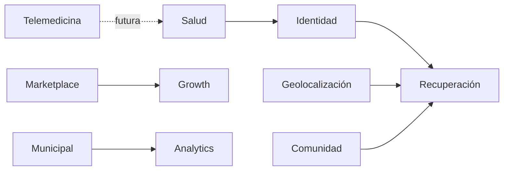

# Modelo de capacidades

Cada fila asigna las capacidades F01-F30 de la [matriz de trazabilidad](../auditoria/FEATURE_TRACEABILITY_MATRIX.md) a una capacidad primaria. La asignación es una taxonomía de negocio, no prueba de disponibilidad. Las denominaciones y estados técnicos de la matriz son autoritativos.

| Capacidad       | Funciones asignadas                                                                                                      | Alcance                                                                    |
| --------------- | ------------------------------------------------------------------------------------------------------------------------ | -------------------------------------------------------------------------- |
| Identidad       | F01 Auth; F02 mascota/QR; F25 administración privilegiada; F28 cuenta familiar                                           | Identidad de persona/mascota y control de acceso.                          |
| Recuperación    | F03 reporte; F04 estado; F05 avistamiento; F14 matching visual; F19 copiloto/agentes; F20 chat/handover/fraude           | F14 no verificado en proveedor; F19 propuesto; no todo el ciclo tiene E2E. |
| Geolocalización | F06 collar; F13 TrackSolid; F21 mapa/búsqueda coordinada                                                                 | Hardware/proveedor y flujo multiusuario no verificados.                    |
| Salud           | F07 historial; F08 clínicas; F23 certificados/campañas                                                                   | F07 sin E2E en corte; F08 parcial; certificados/campañas no probados E2E.  |
| Comunidad       | F16 WhatsApp/directorio; F22 bienestar/aliados/hogares temporales                                                        | Integraciones externas y flujos completos no verificados.                  |
| Marketplace     | F09 adopciones; F10 pedidos de tienda; F11 servicios/reservas; F24 recompensas/bundles/facturación; F30 widgets clínicos | Transacciones/pagos integrales y widgets de terceros no acreditados.       |
| Municipal       | F15 capturas/reportes institucionales                                                                                    | Parcial; envío oficial no implementado.                                    |
| Telemedicina    | F18 consulta remota de audio/video                                                                                       | Declarado no implementado.                                                 |
| Growth          | F12 suscripciones/entitlements; F17 promociones; F27 notificaciones/difusión                                             | Gate comercial, atribución y entregas externas tienen límites propios.     |
| Analytics       | F26 importaciones; F29 NALA/estadísticas públicas                                                                        | No se infiere tracción ni exactitud de producción desde endpoints.         |

## Vistas

Relaciones conceptuales, no eventos/contratos implementados. Para reglas de negocio consultar [BUSINESS_RULES](BUSINESS_RULES.md), [mapa de capacidades existente](CAPABILITY_MAP.md) y `FEATURE_TRACEABILITY_MATRIX.md`.
