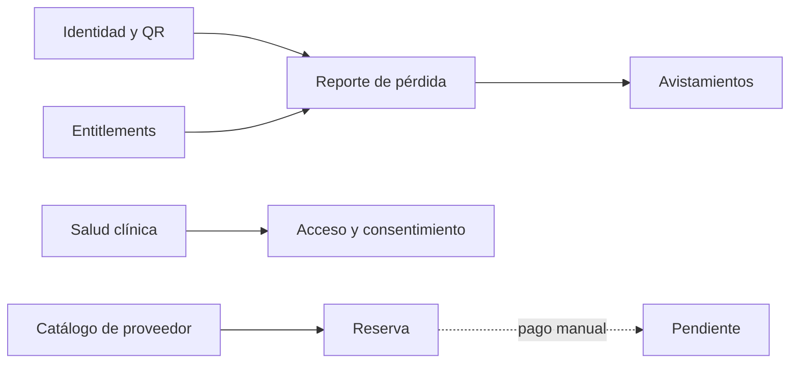

# Mapa de capacidades y dependencias

Relaciones demostradas por [PetsController](../../backend/src/PawTrack.API/Controllers/PetsController.cs), [ReportLostPetCommandHandler](../../backend/src/PawTrack.Application/LostPets/Commands/ReportLostPet/ReportLostPetCommandHandler.cs), [SightingsController](../../backend/src/PawTrack.API/Controllers/SightingsController.cs), [EntitlementService](../../backend/src/PawTrack.Infrastructure/Subscriptions/EntitlementService.cs), [ClinicsController](../../backend/src/PawTrack.API/Controllers/ClinicsController.cs), [ProviderBookingsController](../../backend/src/PawTrack.API/Controllers/ProviderBookingsController.cs) y [gateway manual](../../backend/src/PawTrack.Application/ServiceProviders/Payments/ManualProviderPaymentGateway.cs). Flecha discontinua = no existe cobro automático demostrado. Estados oficiales: [matriz](../auditoria/FEATURE_TRACEABILITY_MATRIX.md).
