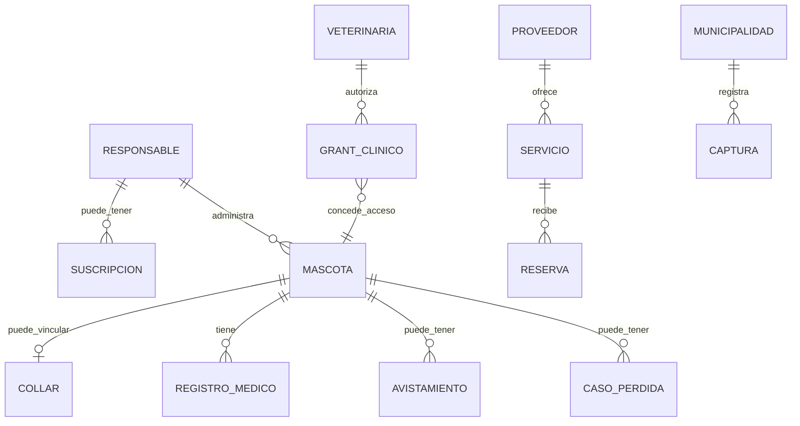

# Ontología de negocio observada

**Corte:** 2026-09-27. La ontología distingue agregados/clases del código y conceptos del negocio; no crea un modelo de datos nuevo. Fuente transversal: [diccionario de datos](../DICCIONARIO_DATOS.md), [modelo EF](../DATA_MODEL.md), módulos en `backend/src/PawTrack.Domain/` y [matriz de capacidades](../auditoria/FEATURE_TRACEABILITY_MATRIX.md).

## Entidades y conceptos

| Concepto                                | Definición y evidencia                                                                                                                                                                                             | Relaciones                                                                              | Responsabilidad/reglas observables                                                                          | Dependencias y límites                                                                                           |
| --------------------------------------- | ------------------------------------------------------------------------------------------------------------------------------------------------------------------------------------------------------------------ | --------------------------------------------------------------------------------------- | ----------------------------------------------------------------------------------------------------------- | ---------------------------------------------------------------------------------------------------------------- |
| Mascota (`Pet`)                         | Perfil de animal identificable; [Pet.cs](../../backend/src/PawTrack.Domain/Pets/Pet.cs).                                                                                                                           | Responsable; `LostPetEvent`; `Sighting`; `MedicalRecord`; `Collar`.                     | Identidad, atributos y estado; ownership debe comprobarse en backend.                                       | QR/fotos y módulos de pérdida, salud y collar; E2E F02 no verificado.                                            |
| Responsable (`User`)                    | Cuenta autenticada que gestiona mascotas; [User.cs](../../backend/src/PawTrack.Domain/Auth/User.cs).                                                                                                               | Mascota, familiares, suscripciones, consentimientos, clínicas/organizaciones según rol. | Identidad, rol, autorización y consentimientos; el GUID no concede acceso.                                  | Auth/MFA/JWT; ver [matriz de autorización](../API_AUTHORIZATION_MATRIX.md).                                      |
| Veterinaria (`Clinic`)                  | Organización clínica; módulo [Clinics](../../backend/src/PawTrack.Domain/Clinics/).                                                                                                                                | Personal, mascota, grant clínico, consulta/registro, certificados, sede.                | Acceso clínico depende de grants/roles; verificación interna no equivale a licencia estatal.                | F08 parcial; operación y flujos por sede requieren validación.                                                   |
| Refugio (`AllyProfile`, tipo `Shelter`) | Actor aliado que puede operar publicación/adopción; [AllyProfile.cs](../../backend/src/PawTrack.Domain/Allies/AllyProfile.cs) y [AllyType.cs](../../backend/src/PawTrack.Domain/Allies/AllyType.cs).               | Personas, animales en adopción, solicitudes y ferias.                                   | Aprobación/estado de aliado y gates de adopción.                                                            | No confundir con una entidad Shelter autónoma ni con una red institucional activa.                               |
| Proveedor (`ServiceProvider`)           | Organización/persona que ofrece servicios; módulo [ServiceProviders](../../backend/src/PawTrack.Domain/ServiceProviders/).                                                                                         | Servicios, disponibilidad, reservas, incidentes y membresía.                            | Catálogo y reserva; gateway de pago manual/pending.                                                         | F11 parcial; licencias, pagos y SLA externos no inferidos.                                                       |
| Municipalidad (`MunicipalityProfile`)   | Perfil institucional municipal; [MunicipalityProfile.cs](../../backend/src/PawTrack.Domain/Municipalities/MunicipalityProfile.cs).                                                                                 | Usuarios institucionales, capturas, campañas/reportes y territorio.                     | Permisos y acceso institucional; convenio no se presume.                                                    | F15 parcial; envío oficial a autoridad no implementado.                                                          |
| Collar (`Collar`)                       | Dispositivo de seguimiento vinculado a mascota; [Collar.cs](../../backend/src/PawTrack.Domain/Collars/Collar.cs).                                                                                                  | Mascota, `CollarLocation`, zonas seguras, claves y auditoría.                           | Propiedad, activación, transferencia y datos de ubicación requieren autorización.                           | Alta handler probada; hardware/proveedor `NO_VERIFICADO`.                                                        |
| Consulta                                | Concepto para agenda/atención clínica, no una entidad única de telemedicina; evidencia en [TELEMEDICINE.md](../domains/TELEMEDICINE.md) y módulo Clinics.                                                          | Clínica, profesional, mascota, responsable, registro clínico.                           | Diferenciar cita/registro presencial de consulta remota.                                                    | Video/audio remoto `DECLARADO_NO_IMPLEMENTADO`.                                                                  |
| Campaña (`CastrationCampaign`)          | Programa con aprobación/capacidad/reservas; [CastrationCampaign.cs](../../backend/src/PawTrack.Domain/CastrationCampaigns/CastrationCampaign.cs).                                                                  | Organización, mascota/responsable, reserva, consentimiento y agenda clínica.            | Ciclo de estados y capacidad según implementación.                                                          | La campaña no prueba un convenio público ni resultados sanitarios.                                               |
| Incidente                               | Concepto transversal, no un agregado único: `ProviderIncident`, `AnimalWelfareCase` y reportes de pérdida son entidades distintas.                                                                                 | Proveedor, mascota, persona que reporta, organización, evidencia.                       | Mantener ownership, moderación, auditoría y estado por módulo; no mezclar incidentes por similitud nominal. | [Threat model de proveedores](../SERVICE_PROVIDERS_THREAT_MODEL.md); F20/F22 sin E2E en el corte.                |
| Vacuna                                  | Registro clínico de vacuna dentro del historial; el modelo de datos documenta vacunas en `MedicalRecord`; certificados en [VaccinePassport.cs](../../backend/src/PawTrack.Domain/Certificates/VaccinePassport.cs). | Mascota, responsable, clínica/veterinario y posible certificado.                        | Distinguir dato informado de certificado verificable; requiere consentimiento/acceso clínico.               | No se encontró evidencia en esta auditoría de agregado `Vaccine` independiente.                                  |
| Telemedicina                            | Servicio de consulta remota por audio/video como concepto de producto.                                                                                                                                             | Responsable, mascota, profesional, clínica, sesión y consentimiento (conceptual).       | No declarar prestación actual; `DECLARADO_NO_IMPLEMENTADO`.                                                 | No hay flujo E2E ni integración de video acreditada; ver [limitaciones](../domains/TELEMEDICINE_LIMITATIONS.md). |
| Servicio (`ProviderService`)            | Oferta de proveedor con disponibilidad/precio y reglas; módulo [ServiceProviders](../../backend/src/PawTrack.Domain/ServiceProviders/).                                                                            | Proveedor, sede, disponibilidad y `ProviderBooking`.                                    | La reserva crea intención; pago manual no significa pago completado.                                        | F11 y [booking flow](../domains/BOOKING_FLOW.md).                                                                |
| Suscripción (`Subscription`)            | Relación de plan, titular, tier, estado e intervalo; [Subscription.cs](../../backend/src/PawTrack.Domain/Subscriptions/Subscription.cs).                                                                           | Usuario/organización, plan, entitlements, referencias de pago.                          | Gate técnico no equivale a aprobación de precio/venta.                                                      | F12 sin validación íntegra de límites; [planes](../commercial/PLANS.md).                                         |

## Relaciones conceptuales

Diagrama conceptual basado en agregados/reglas resumidos en [DICCIONARIO_DATOS](../DICCIONARIO_DATOS.md); no representa cardinalidades SQL completas ni una API contractual. Refugio, consulta, incidente genérico, vacuna autónoma y telemedicina no se dibujan como tablas nuevas.
