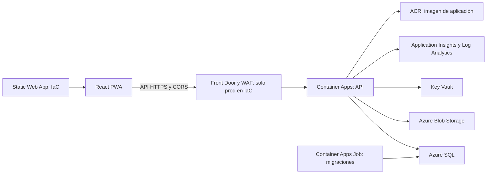

# Grafo de dependencias externas de NALA

**Corte:** 2026-09-29. **Alcance:** lectura estática de código, IaC, configuración y CI; sin consultar suscripciones, secretos ni proveedores en vivo. `CONFIGURADO` significa cableado verificable en el repositorio, **no** servicio aprovisionado u operativo. `PARCIAL` indica piezas faltantes o no probadas; `SOLO CODIGO`, consumidor sin infraestructura comprobada; `SOLO DOCUMENTADO`, intención sin consumidor comprobado; `NO CONFIGURADO`, referencia que requiere valores/permisos ausentes; `DEPRECADO`/`OBSOLETO`, evidencia explícita de retiro; `DESCONOCIDO`, evidencia insuficiente. Ningún servicio se clasifica como operativo en producción sin prueba del entorno.

## Ruta base declarada

Esta es una **topología declarada**, no un diagrama del despliegue actual. La API y el job usan la imagen de ejemplo `mcr.microsoft.com/dotnet/samples:aspnetapp` en [main.bicep](../../infra/main.bicep); el workflow [infra.yml](../../.github/workflows/infra.yml) hace `what-if` en push y solo permite deploy manual. El [docker-compose.yml](../../docker-compose.yml) define SQL Server Developer y Azurite locales, no demuestra Azure SQL ni Storage productivo.

| Dependencia / estado de fuente                                 | Consumidor y feature                                                                          | Si falla / evidencia                                                                                                                                                                                                            |
| -------------------------------------------------------------- | --------------------------------------------------------------------------------------------- | ------------------------------------------------------------------------------------------------------------------------------------------------------------------------------------------------------------------------------- |
| Azure SQL `PARCIAL`                                            | API y job de migraciones: persistencia de identidad, mascotas, casos, comercio y expedientes. | Sin BD falla el flujo transaccional; [main.bicep](../../infra/main.bicep), [Program.cs](../../backend/src/PawTrack.API/Program.cs). Configuración IaC de SQL/Entra no acredita principal utilizable ni migración ejecutada.     |
| Blob Storage `PARCIAL`                                         | API: fotos/evidencias/documentos en contenedores privados.                                    | Sin almacenamiento fallan carga y lectura de archivos; contenedores, lifecycle y rol Blob Data Contributor en [main.bicep](../../infra/main.bicep). Disponibilidad y permisos reales `NO_VERIFICADO`.                           |
| Key Vault / Managed Identity `PARCIAL`                         | API y job: secretos y firma de certificados.                                                  | Si faltan secretos o acceso fallan arranque/integraciones o firmas; [main.bicep](../../infra/main.bicep) asigna roles Secrets/Crypto, pero señala secretos adicionales por poblar.                                              |
| ACA / ACR / Static Web App / Front Door `PARCIAL`              | Hospedaje API, migraciones, PWA y entrada pública.                                            | Sin imagen real o ruta y dominio probados no hay despliegue funcional; [main.bicep](../../infra/main.bicep), [infra.yml](../../.github/workflows/infra.yml). Front Door/WAF son condicionales a prod.                           |
| Application Insights / Log Analytics / Azure Monitor `PARCIAL` | Logs, telemetría y alertas.                                                                   | Se pierde observabilidad y evidencia SLO; recursos declarados en [main.bicep](../../infra/main.bicep), registro del SDK en [Program.cs](../../backend/src/PawTrack.API/Program.cs). Ingesta/alertas operativas `NO_VERIFICADO`. |

## Integraciones por feature

| Dependencia / estado                                                     | Quién la usa y qué sucede si falla                                                                                                                                                                                                                                                                                                                                                                                             |
| ------------------------------------------------------------------------ | ------------------------------------------------------------------------------------------------------------------------------------------------------------------------------------------------------------------------------------------------------------------------------------------------------------------------------------------------------------------------------------------------------------------------------ |
| Azure SignalR `SOLO CODIGO`                                              | Chat y coordinación por hubs en [Program.cs](../../backend/src/PawTrack.API/Program.cs). Sin `AzureSignalR:ConnectionString` usa hubs en proceso; con varias réplicas debe verificarse entrega interinstancia. No hay recurso en [main.bicep](../../infra/main.bicep).                                                                                                                                                         |
| Redis `PARCIAL`                                                          | Caché distribuida y límites de notificación en [DI](../../backend/src/PawTrack.Infrastructure/InfrastructureServiceCollectionExtensions.cs). Sin conexión usa memoria local; verificar semántica multi-réplica. No hay Redis en [main.bicep](../../infra/main.bicep).                                                                                                                                                          |
| Azure Vision (Computer Vision Retrieval) `SOLO CODIGO`                   | Embeddings y validación fotográfica en [AzureVisionEmbeddingService.cs](../../backend/src/PawTrack.Infrastructure/AI/AzureVisionEmbeddingService.cs) y [DI](../../backend/src/PawTrack.Infrastructure/InfrastructureServiceCollectionExtensions.cs). Sin endpoint/key devuelve null; matching/validación se degradan. No atribuir Azure OpenAI o AI Search.                                                                    |
| Azure Maps `SOLO CODIGO`                                                 | Geocoding, reverse geocoding e IP lookup en [AzureMapsGeocodingService.cs](../../backend/src/PawTrack.Infrastructure/Bot/AzureMapsGeocodingService.cs). Sin clave o proveedor, reportes pueden quedar sin coordenadas/cantón; servicio externo no probado.                                                                                                                                                                     |
| OpenStreetMap tiles `CONFIGURADO` en frontend, operación `NO_VERIFICADO` | Render de mapa público en [MapContainer.tsx](../../frontend/src/features/map/components/MapContainer.tsx). Tiles externos fallidos dejan mapa incompleto; no es Azure Maps ni prueba de SLA/licencia comercial.                                                                                                                                                                                                                |
| SendGrid `PARCIAL`                                                       | Verificación de correo, recuperación, alertas y mensajes clínicos: [EmailSender.cs](../../backend/src/PawTrack.Infrastructure/Notifications/EmailSender.cs), [SendGridClinicEmailGateway.cs](../../backend/src/PawTrack.Infrastructure/Clinics/SendGridClinicEmailGateway.cs). Sin clave, envío general pasa a no-op y envío clínico falla; dominio/entrega real `NO_VERIFICADO`.                                              |
| Meta WhatsApp Cloud API `PARCIAL`                                        | Bot y alertas por [MetaWhatsAppSender.cs](../../backend/src/PawTrack.Infrastructure/Bot/MetaWhatsAppSender.cs) y [WhatsAppChannelBroadcaster.cs](../../backend/src/PawTrack.Infrastructure/Broadcast/Channels/WhatsAppChannelBroadcaster.cs). Sin credenciales bot dry-run/canal omitido; aprobación de cuenta/plantillas no probada. Meta Graph API **no** es Microsoft Graph.                                                |
| Telegram Bot API y Facebook Pages API `PARCIAL`                          | Difusión multicanal por [TelegramChannelBroadcaster.cs](../../backend/src/PawTrack.Infrastructure/Broadcast/Channels/TelegramChannelBroadcaster.cs) y [FacebookChannelBroadcaster.cs](../../backend/src/PawTrack.Infrastructure/Broadcast/Channels/FacebookChannelBroadcaster.cs). Sin tokens/canal/página se omiten mensajes; permisos y entrega `NO_VERIFICADO`.                                                             |
| Web Push con VAPID `SOLO CODIGO`                                         | Alertas del navegador en [PushNotificationService.cs](../../backend/src/PawTrack.Infrastructure/Notifications/PushNotificationService.cs) y [sw.ts](../../frontend/src/sw.ts). Sin claves o suscriptores no se entregan push. No prueba Azure Notification Hubs ni FCM/APNS directos.                                                                                                                                          |
| CyberSource/BAC `PARCIAL`                                                | Tarjeta, tokenización y cobro en [CyberSourcePaymentGatewayService.cs](../../backend/src/PawTrack.Infrastructure/Payments/CyberSourcePaymentGatewayService.cs). Sin credenciales devuelve cargo simulado exitoso; [ChargeCardCommand.cs](../../backend/src/PawTrack.Application/Payments/Commands/ChargeCard/ChargeCardCommand.cs) lo registra como exitoso. Bloqueo financiero condicionado a ausencia de configuración real. |
| SINPE/pago manual `PARCIAL`                                              | Referencias y validación de pagos internos en [SinpePaymentService.cs](../../backend/src/PawTrack.Infrastructure/Subscriptions/SinpePaymentService.cs). No prueba API bancaria ni conciliación externa.                                                                                                                                                                                                                        |
| TrackSolid Pro (Jimi IoT) `SOLO CODIGO`                                  | Polling de collar GPS en [TrackSolidService.cs](../../backend/src/PawTrack.Infrastructure/Collars/TrackSolidService.cs). Sin AppKey/AppSecret devuelve posiciones vacías; contrato y señal real `NO_VERIFICADO`.                                                                                                                                                                                                               |
| Proveedor fiscal clínico `PARCIAL`                                       | [ConfiguredClinicFiscalGateway.cs](../../backend/src/PawTrack.Infrastructure/Clinics/ConfiguredClinicFiscalGateway.cs) requiere URL HTTPS/token; [ElectronicBillingService.cs](../../backend/src/PawTrack.Infrastructure/Payments/ElectronicBillingService.cs) genera XML/PDF internos. Sin proveedor falla presentación; generar documento no prueba aceptación oficial.                                                      |
| Webhooks salientes `PARCIAL`                                             | [WebhookFanout.cs](../../backend/src/PawTrack.Infrastructure/Webhooks/WebhookFanout.cs) entrega eventos a endpoints suscritos por terceros. Destinos, entregas y acuerdos `NO_VERIFICADO`; no son webhooks entrantes de Marketplace.                                                                                                                                                                                           |

## Dependencias de presentación y enlaces externos

| Superficie                 | Dependencia y efecto                                                                                                                                                                                                                                                                                                                                                                         |
| -------------------------- | -------------------------------------------------------------------------------------------------------------------------------------------------------------------------------------------------------------------------------------------------------------------------------------------------------------------------------------------------------------------------------------------- |
| Estilos PWA                | [globals.css](../../frontend/src/styles/globals.css) importa Google Fonts; sin CDN se usan fuentes de reemplazo, no falla API.                                                                                                                                                                                                                                                               |
| Guía de chip NFC           | [NfcSetupGuide.tsx](../../frontend/src/features/bundles/components/NfcSetupGuide.tsx) enlaza a NFC Tools en Apple App Store/Google Play. Es guía para escribir la URL mediante app ajena, no lector/pairing nativo; disponibilidad externa `NO_VERIFICADO`.                                                                                                                                  |
| Compartir/consulta externa | [useSharePet.ts](../../frontend/src/features/lost-pets/hooks/useSharePet.ts) abre WhatsApp, Facebook y X en navegación del usuario; [ClinicPublicProfilePage.tsx](../../frontend/src/features/clinics/pages/ClinicPublicProfilePage.tsx) abre Google Maps. No son SDKs de esos proveedores ni promesa de entrega/permiso; revisar consentimiento al transferir ubicación a un sitio tercero. |
| GeoJSON cantonal           | [useCantonChoropleth.ts](../../frontend/src/features/lost-pets/hooks/useCantonChoropleth.ts) carga [cantons-cr.geojson](../../frontend/public/geojson/cantons-cr.geojson) local; no depende de geoboundaries en tiempo de ejecución.                                                                                                                                                         |
| Widget clínico             | [widget.ts](../../frontend/src/widget/widget.ts) tiene `API_BASE` fijo al dominio de producción; al incrustarlo en otro entorno podría consultar API equivocada. Configuración por entorno `PARCIAL`.                                                                                                                                                                                        |
| Tarjeta en navegador       | [CyberSourcePaymentGatewayService.cs](../../backend/src/PawTrack.Infrastructure/Payments/CyberSourcePaymentGatewayService.cs) proporciona URL de Microform JS de CyberSource; cliente y transacción real `NO_VERIFICADO`.                                                                                                                                                                    |

## Reglas de interpretación

- Un `param`, `DbSet`, SDK, mock o secreto _referenciado_ no confirma secreto **presente**; no se inspeccionaron valores de user-secrets, `.env`, Key Vault ni GitHub Secrets.
- `CONFIGURADO` se asignará solo cuando existan consumidor, clave y flujo de configuración coherentes; la validación de permisos reales, proveedor, contrato, costo y producción seguirá `NO_VERIFICADO` sin prueba externa autorizada.
- La ampliación por email, push, IA, pagos, mapas, marketplace y terceros se contrasta en la [matriz de brechas](MISSING_EXTERNAL_CONFIGURATION.md); los servicios sin rastro ejecutable se mantienen separados de los planificados.
