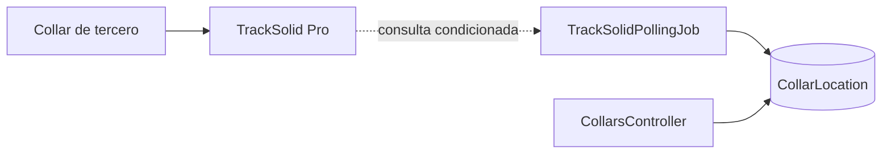

# Arquitectura IoT observada

El diagrama describe la **ruta prevista en código**, no tráfico real: [TrackSolidService](../../backend/src/PawTrack.Infrastructure/Collars/TrackSolidService.cs), [poller DI](../../backend/src/PawTrack.Infrastructure/InfrastructureServiceCollectionExtensions.cs), [modelo de datos](../../backend/src/PawTrack.Infrastructure/Persistence/PawTrackDbContext.cs), [API](../../backend/src/PawTrack.API/Controllers/CollarsController.cs). Firmware propio, OTA, provisioning, certificados de dispositivo y Azure IoT Hub son `NO_VERIFICADO` en esta auditoría; ninguna prueba de hardware se ejecutó. La ruta de ingestión autenticada por clave no sustituye la validación de un dispositivo físico ([middleware registrado](../../backend/src/PawTrack.API/Program.cs)).
