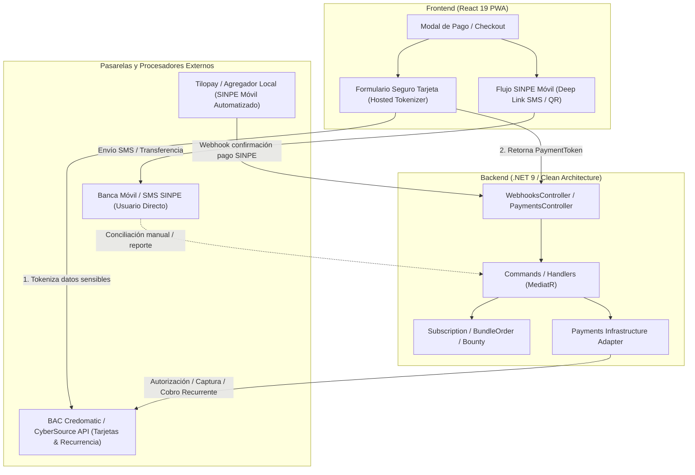

# Arquitectura e Integración de Pasarela de Pagos — PawTrack CR

> **Documento:** `docs/integracionPagos.md`  
> **Fecha:** 2026-09-11  
> **Estado:** Propuesta de arquitectura y plan de ejecución  
> **Áreas impactadas:** Backend (.NET 9), Frontend (React 19 / PWA), Infraestructura (Azure Key Vault, Azure SQL)

---

## 1. Resumen Ejecutivo

PawTrack CR comercializa suscripciones B2C (`UserPlus`, `UserFamilia`), planes B2B (clínicas, tiendas, refugios, municipalidades), bundles de hardware (collares GPS inteligentes, placas QR, combos NFC) y custodia de recompensas (_bounties_).

En el mercado costarricense, el comportamiento de pago se divide en dos canales fundamentales:

1. **SINPE Móvil:** Medio de pago de mayor adopción nacional (>90% de usuarios activos), ideal para transacciones inmediatas, compras únicas (bundles, accesorios) y pagos móviles sin tarjeta.
2. **Tarjetas de Crédito / Débito (Visa, Mastercard):** Indispensable para **cobros recurrentes automáticos** (suscripciones mensuales/anuales), evitando la fricción de renovación manual y reduciendo el churn involuntario.

Este documento detalla la **arquitectura recomendada**, el análisis de opciones de mercado, el diseño técnico de integración bajo Clean Architecture y CQRS, y una lista de control paso a paso para su implementación.

---

## 2. Diagrama de Arquitectura de Pagos



---

## 3. Comparativa de Soluciones y Pasarelas para Costa Rica

| Pasarela / Proveedor             |       Soporte Tarjetas        |       Soporte SINPE Móvil       |     Recurrencia Automática (Token)      | Comisiones Estimadas                | Pros                                                                                                            | Contras                                                                                                  |
| -------------------------------- | :---------------------------: | :-----------------------------: | :-------------------------------------: | ----------------------------------- | --------------------------------------------------------------------------------------------------------------- | -------------------------------------------------------------------------------------------------------- |
| **BAC Credomatic (CyberSource)** | ✅ Completo (Visa/Mastercard) | ⚠️ Opcional vía API Corporativa | ✅ Excelente (Tokenización certificada) | 2.5% – 3.5% + $0.25 por tx          | Conexión bancaria directa, menor costo por transacción, SDK .NET oficial en GitHub (`CyberSource.Rest.Client`). | Trámite de afiliación bancaria más riguroso (1-3 semanas), requiere contrato comercial con el banco.     |
| **Tilopay**                      |          ✅ Completo          | ✅ Automatizado en tiempo real  |              ✅ Soportado               | ~3.99% – 4.5% + $0.35 por tx        | Agregador nacional líder, unifica Tarjetas + SINPE automático en una sola integración con webhooks listos.      | Comisión ligeramente mayor que el adquirente directo.                                                    |
| **Greenpay**                     |          ✅ Completo          |          ✅ Soportado           |              ✅ Soportado               | ~3.5% – 4.0%                        | Procesador costarricense con experiencia local y soporte ágil.                                                  | Ecosistema de SDKs públicos más reducido.                                                                |
| **Stripe**                       |         ✅ Excelente          |    ❌ No soporta SINPE Móvil    |              ✅ Excelente               | 2.9% + $0.30 (si cuenta extranjera) | Mejor DX y documentación del mundo.                                                                             | No opera directamente con cuentas bancarias en Costa Rica (requiere entidad en EE.UU. o intermediación). |

---

## 4. Recomendación Arquitectónica en 2 Fases

### Fase 1: Enfoque Híbrido Inmediato (Pre-lanzamiento / MVP)

- **Tarjetas:** Mantener la pasarela en preparación mediante **CyberSource REST SDK** (`CyberSource.Rest.Client`) o agregador rápido (Tilopay).
- **SINPE Móvil Asistido:**
  - Aprovechar la referencia criptográfica de 8 caracteres ya implementada en `SinpePaymentService.cs`.
  - Incorporar en el frontend un generador de enlaces SMS interactivo (patrón `jonoise/sinpe-react` / `crsolver/sinpepay`) que abra la aplicación de mensajería del smartphone con el texto prellenado:  
    `PASE <MONTO> 88888888 <REFERENCIA_8_CARACTERES>`
  - El usuario no tiene que memorizar números ni montos; presiona "Enviar" en su teléfono y la transferencia queda asociada a la referencia.
  - Conciliación inmediata mediante el endpoint existente `POST /api/webhooks/sinpe` o panel administrativo.

### Fase 2: Automatización Total y Recurrencia (Escalamiento)

- **Tokenización de Tarjetas para Suscripciones:**
  - Almacenar únicamente el `CustomerPaymentProfileId` y los últimos 4 dígitos (`Last4`) en la tabla `UserPaymentProfiles`.
  - Nunca ingresar, procesar ni almacenar números de tarjeta (PAN), fechas de expiración o CVV en los servidores de PawTrack (cumplimiento PCI-DSS SAQ A).
  - Un job en segundo plano (`SubscriptionRecurringBillingJob`) ejecuta el cobro 2 días antes del vencimiento del ciclo (1, 3, 6 o 12 meses) llamando a CyberSource.
- **Confirmación SINPE Automatizada:**
  - Conectar webhook del banco o agregador hacia `POST /api/webhooks/sinpe` con validación de firma HMAC-SHA256 e idempotencia para activación en segundos sin intervención humana.

---

## 5. Diseño Técnico e Implementación en .NET 9

### 5.1 Modelo de Dominio de Métodos de Pago

```csharp
namespace PawTrack.Domain.Payments;

public enum PaymentMethodType
{
    SinpeMovil = 1,
    CreditDebitCard = 2,
}

public sealed class UserPaymentProfile
{
    public Guid Id { get; private set; }
    public Guid UserId { get; private set; }
    public PaymentMethodType MethodType { get; private set; }
    public string ProviderToken { get; private set; } = string.Empty; // Token de CyberSource / Tilopay
    public string? CardBrand { get; private set; } // Visa, Mastercard
    public string? LastFourDigits { get; private set; } // "4242"
    public int? ExpirationMonth { get; private set; }
    public int? ExpirationYear { get; private set; }
    public bool IsDefault { get; private set; }
    public DateTimeOffset CreatedAt { get; private set; }
}
```

### 5.2 Seguridad de Webhooks y Receptores

El controlador `backend/src/PawTrack.API/Controllers/WebhooksController.cs` ya cuenta con la estructura base:

1. **Validación de Firma Criptográfica:** Uso de HMAC-SHA256 en el encabezado `X-Webhook-Signature` contra `Webhooks:SinpeSecret` configurado en Azure Key Vault.
2. **Idempotencia:** Verificación contra la tabla `PaymentTransactions` para garantizar que un identificador de transacción o comprobante bancario no se procese más de una vez.
3. **Desacoplamiento:** Despacho de comandos MediatR (`ActivateSubscriptionCommand`, `ConfirmBountyDepositCommand`) con aislamiento de excepciones para devolver `200 OK` al procesador y evitar reintentos infinitos.

---

## 6. Checklist de Implementación y Control de Avance

A continuación se detalla la lista de control estructurada para el avance de la pasarela:

### Fase 1: Optimización de SINPE Móvil y Preparación de Contratos

- [x] **1.1 UX SINPE Móvil Inteligente:** Integrado deep link de SMS en `SinpePaymentModal.tsx` con número bancario oficial, selector de bancos nacionales (BAC, BNCR, BCR, Davivienda) y comando prellenado (`PASE <monto> <tel> <ref>`).
- [x] **1.2 Generador de QR SINPE:** Generación de código QR dinámico mediante CQRS `GetSubscriptionQrCodeQuery` (`/api/subscriptions/{id}/sinpe-qr`) y renderizado visual en pestaña dedicada en el modal.
- [x] **1.3 Validación de Comprobantes:** Campo para reporte de comprobante bancario (`BankReceiptNumber`) en `Subscription.cs`, `ReportPaymentCommand`, `SubscriptionsController` y visualización en el panel administrativo.
- [ ] **1.4 Afiliación Comercial:** Iniciar proceso de afiliación e-commerce con BAC Credomatic (o contratación de Tilopay como agregador).
- [ ] **1.5 Parámetros en Key Vault:** Crear secretos `Payments:ProviderKey`, `Payments:MerchantId` y `Payments:SecretKey` en Azure Key Vault.

### Fase 2: Integración de Tarjetas y Tokenización

- [x] **2.1 Dependencia SDK & Gateway Adapter:** Implementado `CyberSourcePaymentGatewayService` en `PawTrack.Infrastructure/Payments` con soporte para firma HMAC-SHA256, autenticación y degradación simulada en dev/test.
- [x] **2.2 Adaptador de Pasarela:** Implementada interfaz `IPaymentGatewayService` en Application e inyectada con resiliencia de HttpClient y soporte de Key Vault (`CyberSource:*` y `Payments:*`).
- [x] **2.3 Hosted Form / Microform & UI Completa:** Implementado componente `SecureCardPaymentForm.tsx` en React para captura segura de tarjeta (PCI-DSS SAQ A), sección completa de gestión de tarjetas guardadas `PaymentMethodsCard.tsx` en `ProfilePage.tsx`, y opciones de depósito de recompensas con tarjeta en `BountyWidget.tsx`.
- [x] **2.4 Entidad de Perfiles de Pago:** Creadas entidades de dominio `UserPaymentProfile` y `PaymentTransaction`, repositorios, configuraciones de EF Core y migración `20260912010830_AddUserPaymentProfilesAndTransactions`.
- [x] **2.5 Cobro de Bundles, Recompensas y Suscripciones:** Integrado cobro directo con tarjeta en `BundleOrderModal.tsx`, `SinpePaymentModal.tsx`, `BountyWidget.tsx` y comando `ChargeCardCommand.cs` con confirmación inmediata.

### Fase 3: Cobro Recurrente y Automatización Total

- [x] **3.1 Job de Renovación Automática:** Implementado `SubscriptionRecurringBillingHostedService` en `PawTrack.Infrastructure/Payments` con `PeriodicTimer`, ejecución diaria a las 04:00 CR y `IDistributedJobLock` para renovaciones seguras multi-nodo con tarjetas guardadas.
- [x] **3.2 Notificaciones de Cobro:** Integradas plantillas HTML y despacho de correos transaccionales en `IEmailSender` y `EmailSender`: `SendRecurringPaymentReceiptAsync` (recibo exitoso con desglose y próximos vencimientos) y `SendRecurringPaymentFailedAsync` (alerta de tarjeta rechazada con período de gracia y enlace de actualización).
- [x] **3.3 Webhook SINPE en Tiempo Real e Idempotencia:** `WebhooksController.cs` ampliado con deduplicación criptográfica contra `PaymentTransactions`, soporte para confirmación de órdenes de hardware (`BundleOrders`), depósitos de recompensas (`Bounties`) y suscripciones.
- [x] **3.4 Facturación Electrónica & CABYS:** Implementado `CabysCatalog.cs` en `PawTrack.Domain/Payments` con los códigos CABYS oficiales del Banco Central de Costa Rica para SaaS (8314300000000), collares GPS (4525000000000), placas QR (4299900000000), tags de silicona (3699000000000) y modelo DGT v4.3 con 13% de IVA.

---

## 7. Recomendaciones Estratégicas y de Operación

1. **Evitar intermediarios en cobros recurrentes de alto volumen:** Si las suscripciones B2C escalan a miles de usuarios, la diferencia entre la comisión directa del banco (~2.8%) y la de un agregador (~4.5%) representa un ahorro financiero considerable. Se recomienda iniciar los trámites de afiliación e-commerce con BAC Credomatic tempranamente.
2. **Priorizar la experiencia móvil en Costa Rica:** En Costa Rica, el pago por SINPE Móvil mediante SMS o app bancaria tiene una conversión superior al 70% frente a pedir números de tarjeta en un formulario web. Implementar los deep links de SMS en la PWA reducirá inmediatamente la fricción de pago.
3. **Idoneidad de los términos de suscripción:** Como ya se implementó el selector de 1, 3, 6 y 12 meses con 20% de descuento anual, incentivar el pago anual en el checkout reduce las comisiones fijas por transacción de las pasarelas.
4. **Cumplimiento Tributario (IVA 13%):** Las suscripciones digitales y la venta de collares físicos en Costa Rica están sujetas al 13% de IVA. El precio mostrado al consumidor final debe indicar claramente si incluye impuestos y sincronizarse con la partida contable.
