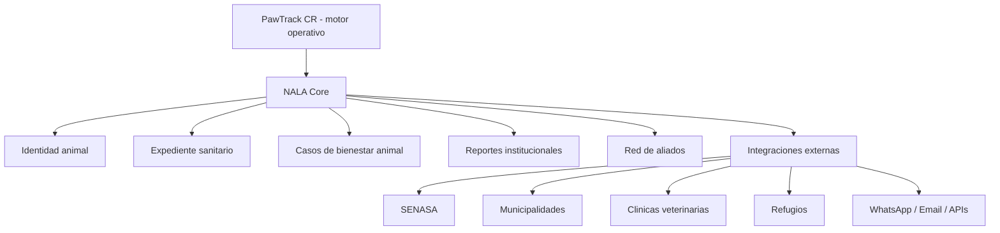

# PawTrack CR / NALA — Alineacion SENASA y Bienestar Animal

> Documento enterprise para evolucionar PawTrack CR hacia una plataforma alineada
> con SENASA, la Ley de Bienestar de los Animales de Costa Rica y la vision NALA.
> Fecha: 2026-09-06.

---

## 1. Resumen ejecutivo

PawTrack CR ya tiene una base tecnica muy cercana a una plataforma nacional de
trazabilidad y bienestar animal: identidad digital de mascotas, QR, microchip,
expediente medico, clinicas con licencia SENASA, municipalidades, refugios,
adopciones, collares GPS, reportes de perdida, avistamientos, IA visual, chat
enmascarado, certificados PDF verificables y controles fuertes de privacidad.

La evolucion recomendada no es reescribir el producto, sino crear una capa
enterprise nueva encima de lo existente:

1. **SENASA-ready:** datos, certificados, reportes, auditoria y exportaciones en
   formatos compatibles con procesos institucionales.
2. **Bienestar animal:** casos formales de abandono, maltrato, negligencia,
   animales heridos, capturas, rescate, adopcion y seguimiento.
3. **NALA Core:** capa de ecosistema que conecta PawTrack con clinicas,
   municipalidades, refugios, aliados, comunidad y, eventualmente, SENASA.
4. **Integracion oficial SENASA:** solo debe declararse cuando exista convenio,
   canal tecnico aprobado, criterios de intercambio y validacion juridica.

Conclusion: **si podemos evolucionar el app para alinearlo con SENASA y la Ley de
Bienestar Animal**. La ruta correcta es posicionar a PawTrack como motor operativo
y a NALA como red nacional de bienestar animal y trazabilidad.

---

## 2. Alcance y advertencia legal

Este documento define una estrategia tecnica y operativa. No sustituye criterio
legal, criterio veterinario ni autorizacion institucional.

PawTrack puede implementar funcionalidades **compatibles** con SENASA y con
obligaciones de bienestar animal, pero no debe afirmar que emite documentos
oficiales de SENASA ni que esta integrado oficialmente con SENASA hasta que se
cumplan al menos estas condiciones:

- convenio o autorizacion escrita con la institucion correspondiente;
- definicion formal del formato/documento aceptado;
- canal tecnico aprobado: API, carga manual, correo institucional, interoperabilidad
  documental o expediente electronico;
- reglas de firma, verificacion, retencion y auditoria;
- revision legal de privacidad, transferencia de datos y responsabilidades.

Terminologia recomendada antes del convenio:

- Usar: **SENASA-ready**, **formato compatible**, **reporte institucional**, **QR
  verificable**, **expediente exportable**.
- Evitar: **certificado oficial SENASA**, **integrado con SENASA**, **aprobado por
  SENASA**, **valido ante SENASA**, salvo autorizacion real.

---

## 3. Estado actual de PawTrack CR

### 3.1 Capacidades ya implementadas

El producto actual ya incluye las piezas esenciales para construir una capa
regulatoria:

| Area                 | Estado                | Evidencia funcional                                                                  |
| -------------------- | --------------------- | ------------------------------------------------------------------------------------ |
| Identidad de mascota | Implementado          | Mascotas con QR, foto, especie, raza, fecha de nacimiento y microchip ISO 11784.     |
| Recuperacion         | Implementado          | Reportes de perdida, avistamientos, case room, busqueda en campo y reunificacion.    |
| Privacidad           | Implementado          | Avistamientos anonimos, chat enmascarado, PII scrubber, contacto protegido.          |
| Clinicas             | Implementado          | Registro de clinicas con `LicenseNumber` SENASA, estado pendiente/activo/suspendido. |
| Expediente medico    | Implementado          | Registros medicos, recordatorios, documentos en Blob Storage, exportacion PDF.       |
| Consentimiento salud | Implementado          | Consentimiento diferenciado para datos de salud bajo Ley 8968.                       |
| Certificados         | Implementado base     | `VetCertificate`, `CertificateType.VaccinePassport`, verificacion por codigo y PDF.  |
| Municipalidades      | Implementado          | Capturas, fotos, estados, estadisticas, red regional y transferencias.               |
| Adopciones/refugios  | Implementado          | Animales adoptables, solicitudes, ferias y estado de adopcion.                       |
| Aliados              | Implementado          | Organizaciones verificadas por cobertura geografica.                                 |
| Collares GPS         | Implementado          | Ubicacion, historial, zonas seguras, lost mode y auditoria.                          |
| Proteccion de datos  | Implementado avanzado | Exportacion de datos, eliminacion de cuenta, retencion/purga y controles BOLA.       |

### 3.2 Archivos y modulos relevantes

- Vision NALA: [`docs/NALA.md`](./NALA.md)
- Estado tecnico principal: [`docs/PawTrack_Documento_Maestro_v3.1.md`](./PawTrack_Documento_Maestro_v3.1.md)
- Cumplimiento Ley 8968: [`docs/CUMPLIMIENTO_PROTECCION_DATOS.md`](./CUMPLIMIENTO_PROTECCION_DATOS.md)
- Expediente medico: [`docs/expediente.md`](./expediente.md)
- Certificados veterinarios: `backend/src/PawTrack.Domain/Certificates/`
- Controlador de certificados: `backend/src/PawTrack.API/Controllers/CertificatesController.cs`
- Municipalidades: `backend/src/PawTrack.Domain/Municipalities/`
- Clinicas: `backend/src/PawTrack.Domain/Clinics/Clinic.cs`
- Mascotas: `backend/src/PawTrack.Domain/Pets/Pet.cs`

### 3.3 Lo que ya existe para pasaporte/certificado

El codigo actual ya contiene una implementacion base:

- `VetCertificate` con `VerificationCode`, `PdfUrl`, `ValidUntil`, `IsRevoked`.
- `CertificateType.VaccinePassport`.
- `IssueVaccinePassportCommand`.
- `CertificatePdfData` con campos de vacuna, control antiparasitario, color,
  microchip y propietario.
- `POST /api/certificates/passport`.
- `GET /api/certificates/verify/{code}` publico.
- `QuestPdfCertificateService` con layout especifico para Vaccine Passport.

Sin embargo, la version actual todavia debe endurecerse para nivel enterprise:

- validar que la clinica solicitante sea realmente la misma del token;
- verificar grant activo del expediente medico entre pet y clinica;
- persistir datos estructurados del pasaporte, no solo PDF/certificado generico;
- validar licencia de veterinario y formato requerido;
- exigir rabia para perros cuando aplique;
- agregar auditoria de emision, revocacion, descarga y verificacion publica;
- separar claramente certificado PawTrack de certificado oficial SENASA.

---

## 4. Vision objetivo: NALA como capa de ecosistema

NALA debe funcionar como la capa superior de mision, interoperabilidad e impacto.
PawTrack CR queda como el motor transaccional.



### 4.1 Responsabilidad de PawTrack

PawTrack debe seguir resolviendo operacion diaria:

- registro de usuarios y mascotas;
- QR y microchip;
- reportes de perdida;
- avistamientos;
- busqueda y reunificacion;
- expediente medico;
- certificados PDF;
- adopciones;
- capturas municipales;
- collares GPS;
- notificaciones y chat.

### 4.2 Responsabilidad de NALA

NALA debe ordenar la capa pais:

- indicadores agregados de bienestar animal;
- interoperabilidad con instituciones;
- red verificada de operadores;
- trazabilidad de casos;
- reportes cantonales/regionales;
- tablero de impacto social;
- coordinacion entre clinicas, municipalidades, refugios y aliados;
- eventual adaptador oficial SENASA.

---

## 5. Alineacion con SENASA

### 5.1 Objetivo funcional

Crear una base de datos y flujos verificables que permitan generar expedientes,
reportes y certificados compatibles con necesidades sanitarias e institucionales.

### 5.2 Capacidades SENASA-ready recomendadas

| Capacidad                    | Descripcion                                                                       | Prioridad                       |
| ---------------------------- | --------------------------------------------------------------------------------- | ------------------------------- |
| Identidad sanitaria animal   | Perfil extendido con sexo, color, senas, microchip, esterilizacion y responsable. | Alta                            |
| Verificacion de clinicas     | Licencia SENASA, documentos, estado de verificacion, vencimiento y revalidacion.  | Alta                            |
| Verificacion de veterinarios | Licencia profesional, nombre, firma, clinica asociada y permisos de emision.      | Alta                            |
| Pasaporte veterinario        | Documento bilingue con vacunas, antiparasitario, microchip, QR y vigencia.        | Alta                            |
| Certificados verificables    | QR publico para validar autenticidad, vigencia y revocacion.                      | Alta                            |
| Export institucional         | PDF/CSV/JSON por periodo, canton, especie, estado y organizacion.                 | Alta                            |
| Bitacora auditada            | Emision, revocacion, descarga, verificacion, cambios y envios externos.           | Alta                            |
| Bandeja institucional        | Vista para municipalidades/admin sobre casos y reportes enviados.                 | Media                           |
| Adaptador SENASA             | API/webhook/export/carga manual segun canal aprobado.                             | Media-alta, depende de convenio |

### 5.3 Datos adicionales para `Pet`

El modelo actual de mascota es suficiente para recuperacion, pero para alineacion
sanitaria conviene agregar campos opcionales y versionados:

| Campo                         | Tipo sugerido              | Nota                                                        |
| ----------------------------- | -------------------------- | ----------------------------------------------------------- |
| `Sex`                         | enum `Unknown/Male/Female` | Relevante para trazabilidad sanitaria.                      |
| `Color`                       | string?                    | Ya aparece como necesidad en pasaporte.                     |
| `DistinctiveMarks`            | string?                    | Senas particulares.                                         |
| `SterilizedStatus`            | enum `Unknown/Yes/No`      | Clave para bienestar y politica publica.                    |
| `SterilizedAt`                | DateOnly?                  | Si existe respaldo clinico.                                 |
| `ResidenceCanton`             | string?                    | Reportes agregados sin exponer direccion exacta.            |
| `ResponsibleOwnerId`          | Guid                       | Hoy equivale a `OwnerId`; conservar trazabilidad historica. |
| `MicrochipVerifiedAt`         | DateTimeOffset?            | Diferenciar declarado vs verificado.                        |
| `MicrochipVerifiedByClinicId` | Guid?                      | Evidencia de verificacion.                                  |

No se recomienda hacer obligatorios estos campos para usuarios Free al inicio. Deben
ser progresivos y completables por clinica o propietario.

### 5.4 Verificacion de clinicas

La entidad `Clinic` ya tiene `LicenseNumber`. Para enterprise se recomienda crear
una entidad complementaria:

```csharp
public sealed class ClinicVerification
{
    public Guid Id { get; private set; }
    public Guid ClinicId { get; private set; }
    public string LicenseNumber { get; private set; }
    public string? DocumentUrl { get; private set; }
    public VerificationStatus Status { get; private set; }
    public DateTimeOffset SubmittedAt { get; private set; }
    public DateTimeOffset? VerifiedAt { get; private set; }
    public Guid? VerifiedByAdminUserId { get; private set; }
    public DateOnly? ExpiresAt { get; private set; }
    public string? RejectionReason { get; private set; }
}
```

Reglas:

- una clinica no debe emitir pasaportes enterprise si no esta activa y verificada;
- la licencia debe ser unica;
- cualquier cambio de licencia debe abrir nueva verificacion;
- documentos privados deben guardarse en Blob Storage no publico;
- el estado de verificacion debe auditarse.

### 5.5 Verificacion de veterinarios emisores

El comando actual recibe `VetName` y `VetLicense`, pero esto no basta para
enterprise. Se recomienda agregar `ClinicVeterinarian`:

```csharp
public sealed class ClinicVeterinarian
{
    public Guid Id { get; private set; }
    public Guid ClinicId { get; private set; }
    public string FullName { get; private set; }
    public string LicenseNumber { get; private set; }
    public string? SignatureImageUrl { get; private set; }
    public bool CanIssueCertificates { get; private set; }
    public DateTimeOffset CreatedAt { get; private set; }
    public DateTimeOffset? RevokedAt { get; private set; }
}
```

Reglas:

- solo veterinarios activos pueden emitir;
- revocar un veterinario no revoca certificados pasados automaticamente;
- cada certificado debe guardar snapshot del nombre/licencia al momento de emision;
- firma grafica o digital debe tener control de acceso y auditoria.

### 5.6 Pasaporte veterinario / certificado OIRSA-SENASA-ready

El feature actual debe evolucionar de certificado generico a pasaporte
estructurado.

Entidad recomendada:

```csharp
public sealed class VaccinePassport
{
    public Guid Id { get; private set; }
    public Guid CertificateId { get; private set; }
    public Guid PetId { get; private set; }
    public Guid IssuingClinicId { get; private set; }
    public Guid IssuingVeterinarianId { get; private set; }
    public string IssuingVetNameSnapshot { get; private set; }
    public string IssuingVetLicenseSnapshot { get; private set; }
    public string ClinicLicenseSnapshot { get; private set; }
    public DateTimeOffset IssuedAt { get; private set; }
    public DateOnly ValidUntil { get; private set; }
    public string VerificationCode { get; private set; }
    public string IsoFormat { get; private set; } = "OIRSA-CR";
    public string SchemaVersion { get; private set; } = "1.0";
}
```

Datos minimos:

- identificacion del animal;
- microchip;
- especie, raza, sexo, color, edad aproximada;
- propietario responsable;
- vacunas, especialmente rabia cuando aplique;
- marca, lote, fecha de aplicacion y vigencia;
- desparasitacion/control antiparasitario;
- clinica emisora;
- veterinario emisor;
- licencia de clinica y veterinario;
- fecha de emision y vencimiento;
- QR de verificacion publica;
- estado: valido, expirado, revocado.

Validaciones recomendadas:

- perros: vacuna antirrabica requerida si el caso de uso es viaje/certificado sanitario;
- `ValidUntil` no puede exceder la vigencia de vacunas obligatorias;
- no emitir si el pet no tiene grant medico activo para la clinica;
- no emitir si el microchip declarado no coincide con el pet, salvo flujo de correccion;
- no emitir si la clinica no es `ClinicPartner` y verificada;
- no emitir si el veterinario no esta autorizado;
- todos los textos libres pasan por validadores de longitud y sanitizacion.

---

## 6. Alineacion con Ley de Bienestar Animal

### 6.1 Objetivo funcional

Convertir eventos dispersos en casos formales de bienestar animal con triage,
evidencia, seguimiento, derivacion y cierre.

### 6.2 Modulo propuesto: `AnimalWelfareCases`

Este modulo debe ser separado de `LostPets`, `Sightings`, `Municipalities` y
`Adoptions`. Puede consumir eventos mediante MediatR/domain events, pero no debe
llamar directamente servicios internos de otros modulos.

Tipos de caso sugeridos:

- abandono;
- posible maltrato;
- negligencia o falta de atencion veterinaria;
- animal herido;
- animal en via publica en riesgo;
- captura municipal;
- acumulacion o tenencia inadecuada;
- animal agresivo o con riesgo comunitario;
- rescate pendiente;
- seguimiento post-adopcion;
- solicitud de inspeccion o derivacion institucional.

Estados sugeridos:

```text
Received -> Triage -> Assigned -> InProgress -> Referred -> Resolved
                                      |              |
                                      v              v
                                  Dismissed      ClosedNoAction
```

Entidad base recomendada:

```csharp
public sealed class AnimalWelfareCase
{
    public Guid Id { get; private set; }
    public WelfareCaseType Type { get; private set; }
    public WelfareCaseStatus Status { get; private set; }
    public WelfareSeverity Severity { get; private set; }
    public Guid? PetId { get; private set; }
    public Guid? LostPetEventId { get; private set; }
    public Guid? CapturedAnimalId { get; private set; }
    public Guid? AdoptionPetId { get; private set; }
    public string Canton { get; private set; }
    public double? ApproxLat { get; private set; }
    public double? ApproxLng { get; private set; }
    public string DescriptionSanitized { get; private set; }
    public Guid? ReporterUserId { get; private set; }
    public bool ReporterIsAnonymous { get; private set; }
    public Guid? AssignedOrganizationUserId { get; private set; }
    public DateTimeOffset CreatedAt { get; private set; }
    public DateTimeOffset? ClosedAt { get; private set; }
}
```

Entidades complementarias:

- `AnimalWelfareEvidence`: fotos, documentos, hash, metadata segura;
- `AnimalWelfareCaseNote`: bitacora interna, visible segun rol;
- `AnimalWelfareReferral`: derivacion a municipalidad, aliado, clinica o SENASA;
- `AnimalWelfareCaseAuditLog`: cambios de estado, asignaciones, descargas;
- `AnimalWelfareCasePublicRedaction`: version publica minimizada del caso.

### 6.3 Triage y derivacion

No todo caso debe ir directo a SENASA. Se recomienda un modelo de triage:

| Tipo de caso       | Primer receptor recomendado    | Derivacion posible                             |
| ------------------ | ------------------------------ | ---------------------------------------------- |
| Mascota perdida    | PawTrack / comunidad / aliados | Municipalidad si captura.                      |
| Animal herido      | Aliado o clinica cercana       | Municipalidad / SENASA segun gravedad.         |
| Abandono           | Admin o municipalidad          | SENASA si procede.                             |
| Maltrato           | Admin especializado            | Autoridad competente / SENASA segun protocolo. |
| Captura municipal  | Municipalidad                  | SENASA/reportes agregados.                     |
| Adopcion irregular | Refugio/admin                  | Municipalidad/SENASA si hay riesgo.            |

El sistema debe registrar siempre:

- motivo de derivacion;
- datos incluidos en el envio;
- datos excluidos por privacidad;
- usuario que derivo;
- fecha/hora;
- receptor;
- acuse de recibo si existe;
- estado posterior.

---

## 7. Arquitectura enterprise propuesta

### 7.1 Modulos nuevos

| Modulo               | Capa                              | Responsabilidad                                            |
| -------------------- | --------------------------------- | ---------------------------------------------------------- |
| `Regulatory`         | Domain/Application/Infrastructure | Reportes institucionales, exportaciones, adaptadores.      |
| `AnimalWelfare`      | Domain/Application/Infrastructure | Casos de bienestar animal, evidencia, triage y derivacion. |
| `ClinicVerification` | Domain/Application                | Verificacion documental de clinicas y veterinarios.        |
| `NalaCore`           | Application/API                   | Dashboard pais, indicadores e interoperabilidad.           |

### 7.2 Eventos que deben alimentar NALA

Eventos existentes o recomendados:

- `PetCreatedDomainEvent`;
- `LostPetReportedDomainEvent`;
- `SightingReportedDomainEvent`;
- `PetReunitedDomainEvent`;
- `MedicalRecordAddedDomainEvent`;
- `CertificateIssuedDomainEvent`;
- `CapturedAnimalRecordedDomainEvent`;
- `AdoptionApplicationApprovedDomainEvent`;
- `AdoptablePetMarkedAdoptedDomainEvent`;
- `AnimalWelfareCaseReportedDomainEvent`;
- `AnimalWelfareCaseReferredDomainEvent`.

La recomendacion es publicar estos eventos al Outbox cuando provienen de cambios
de agregado durante request pipeline. Los jobs programados pueden seguir el patron
existente de despacho directo cuando sea apropiado.

### 7.3 API publica y API institucional

Separar claramente:

| API                  | Ruta sugerida                     | Auth                  | Uso                                              |
| -------------------- | --------------------------------- | --------------------- | ------------------------------------------------ |
| Verificacion publica | `/api/public/certificates/{code}` | No                    | Validar certificado sin exponer datos sensibles. |
| Reporte ciudadano    | `/api/public/welfare-cases`       | Opcional              | Reportar posible caso con minimizacion de datos. |
| Portal institucional | `/api/institutional/*`            | Roles institucionales | Municipalidades, aliados, admin, futuro SENASA.  |
| NALA dashboard       | `/api/nala/*`                     | Admin/Institutional   | Indicadores agregados y mapas operativos.        |
| Export regulatorio   | `/api/regulatory/exports/*`       | Admin/Institutional   | CSV/JSON/PDF por periodo y canton.               |

### 7.4 Integracion externa con SENASA

Preparar una interfaz, aunque la implementacion inicial sea archivo/export:

```csharp
public interface IRegulatorySubmissionGateway
{
    Task<RegulatorySubmissionResult> SubmitAsync(
        RegulatorySubmissionPackage package,
        CancellationToken cancellationToken = default);
}
```

Implementaciones posibles:

- `ManualExportRegulatorySubmissionGateway`: genera PDF/CSV/JSON para descarga.
- `EmailRegulatorySubmissionGateway`: envia a buzon institucional autorizado.
- `ApiRegulatorySubmissionGateway`: integra con API oficial si existe convenio.
- `NoOpRegulatorySubmissionGateway`: ambientes dev/test.

Cada envio debe registrar un `RegulatorySubmission`:

- id;
- tipo de paquete;
- destino;
- formato;
- hash del payload;
- blob privado del payload;
- enviado por;
- enviado en;
- estado;
- respuesta o acuse;
- errores;
- reintentos.

---

## 8. Seguridad, privacidad y cumplimiento

### 8.1 Principios obligatorios

- Minimizar datos personales en vistas publicas.
- Separar datos de mascota, datos de propietario y datos de reportante.
- Usar consentimiento explicito para datos de salud.
- No exponer direccion exacta del hogar.
- No exponer telefono salvo flujo controlado.
- Mantener evidencia sensible en Blob Storage privado.
- Auditar acceso institucional a expedientes y casos.
- Aplicar rate limiting a reportes publicos, verificacion y exports.
- Usar roles y ownership checks en todos los endpoints internos.
- Registrar bases de datos ante PRODHAB si corresponde al lanzamiento comercial.
- Confirmar DPA con Microsoft/Azure por transferencia internacional.

### 8.2 Datos sensibles por categoria

| Categoria                           | Riesgo     | Regla                                                         |
| ----------------------------------- | ---------- | ------------------------------------------------------------- |
| Salud animal asociada a propietario | Alto       | Consentimiento diferenciado y acceso restringido.             |
| Ubicacion GPS collar                | Alto       | Retencion corta, rango limitado y ownership estricto.         |
| Ubicacion de caso de bienestar      | Alto       | Mostrar aproximada en publico, exacta solo institucional.     |
| Identidad del reportante            | Alto       | Anonimato por defecto; revelar solo con base legal/protocolo. |
| Evidencia de maltrato               | Alto       | Blob privado, moderacion, redaccion y cadena de custodia.     |
| Certificados                        | Medio-alto | Verificacion publica minimizada y revocacion visible.         |

### 8.3 Auditoria minima

Agregar o reutilizar auditoria para:

- emision de certificado;
- descarga de certificado;
- verificacion publica de certificado;
- revocacion de certificado;
- acceso de clinica a expediente;
- creacion de caso de bienestar;
- cambio de severidad;
- cambio de estado;
- asignacion a aliado/municipalidad;
- derivacion institucional;
- exportacion de datos;
- envio a integracion externa.

---

## 9. Experiencia de usuario requerida

### 9.1 Dueño de mascota

- Completar datos sanitarios de la mascota progresivamente.
- Ver estado de microchip: no registrado, declarado, verificado por clinica.
- Autorizar acceso medico a una clinica.
- Ver pasaportes/certificados emitidos.
- Descargar PDF.
- Ver historial de verificaciones publicas sin datos excesivos.
- Reportar caso de bienestar si encuentra un animal en riesgo.

### 9.2 Clinica

- Completar verificacion documental.
- Administrar veterinarios autorizados.
- Solicitar o aceptar grant de expediente.
- Emitir certificado/pasaporte desde datos prellenados.
- Ver errores claros si falta microchip, vacuna, grant o licencia.
- Revocar certificado con motivo.

### 9.3 Municipalidad

- Registrar captura.
- Asociar captura con microchip/QR/PawTrack pet.
- Convertir captura en caso de bienestar si hay abandono/negligencia.
- Exportar reporte por periodo/canton.
- Transferir casos a red regional.
- Ver mapa agregado sin datos privados innecesarios.

### 9.4 Aliado/refugio

- Recibir casos asignados.
- Subir evidencia.
- Registrar accion tomada.
- Vincular caso con adopcion o custodia temporal.
- Cerrar con resultado.

### 9.5 Admin/NALA

- Dashboard nacional/regional.
- Cola de triage.
- Verificacion de clinicas y veterinarios.
- Revision de evidencia sensible.
- Export institucional.
- Configuracion de retencion.
- Monitoreo de integraciones.

---

## 10. Roadmap de implementacion

### Fase 0 — Validacion institucional y legal

Objetivo: reducir riesgo antes de construir funcionalidades que prometan validez
oficial.

Entregables:

- matriz legal: SENASA, bienestar animal, PRODHAB, terminos, privacidad;
- glosario de nombres permitidos y prohibidos;
- confirmacion de si se buscara convenio SENASA desde el inicio;
- definicion de documentos que PawTrack puede emitir por cuenta propia;
- decision sobre retencion de evidencia sensible.

### Fase 1 — Endurecer certificado/pasaporte existente

Objetivo: convertir el certificado actual en un flujo enterprise robusto.

Entregables:

- ownership/role check corregido para `ClinicId` vs usuario autenticado;
- grant medico obligatorio para emitir pasaporte;
- verificacion de clinica activa + `ClinicPartner` + verificacion documental;
- `ClinicVeterinarian` y permisos de emision;
- validaciones por especie;
- entidad `VaccinePassport` estructurada;
- auditoria de emision/revocacion/verificacion;
- tests unitarios e integracion.

### Fase 2 — Identidad sanitaria extendida

Objetivo: enriquecer `Pet` sin romper el flujo simple de registro.

Entregables:

- campos sanitarios opcionales;
- verificacion de microchip por clinica;
- historial de cambios criticos;
- UI progresiva en perfil de mascota;
- export sanitario por mascota.

### Fase 3 — Casos de bienestar animal

Objetivo: formalizar reportes y derivaciones.

Entregables:

- modulo `AnimalWelfare`;
- entidad `AnimalWelfareCase`;
- evidencia privada;
- triage y estados;
- asignacion a municipalidad/aliado/refugio;
- bitacora y auditoria;
- portal admin/NALA;
- endpoint publico minimizado.

### Fase 4 — Reportes institucionales

Objetivo: producir datos utiles para municipalidades, aliados y futura integracion
SENASA.

Entregables:

- reportes por canton y periodo;
- capturas, perdidas, reunificaciones, adopciones, casos y certificados;
- CSV/JSON/PDF;
- anonimizacion/agregacion para inteligencia publica;
- exports con hash y blob privado;
- registro de descargas/envios.

### Fase 5 — NALA Core

Objetivo: crear la capa pais.

Entregables:

- dashboard NALA;
- mapa operacional multicapa;
- indicadores de impacto;
- ranking institucional;
- SLA/tiempo de respuesta;
- analitica por canton;
- API institucional.

### Fase 6 — Integracion oficial SENASA

Objetivo: activar canal formal cuando exista convenio.

Entregables:

- `IRegulatorySubmissionGateway` real;
- autenticacion/API keys/certificados segun canal oficial;
- acuse de recibo;
- reintentos e idempotencia;
- monitoreo y alertas;
- documentacion operativa;
- pruebas con ambiente sandbox o piloto.

---

## 11. Backlog tecnico recomendado

### Backend

- Crear modulo `AnimalWelfare` en Domain/Application/Infrastructure.
- Crear modulo o submodulo `Regulatory` para exports e integraciones.
- Crear `ClinicVerification` y `ClinicVeterinarian`.
- Crear `VaccinePassport` estructurado.
- Agregar domain events para certificados, capturas, adopciones y bienestar.
- Agregar repositorios con queries paginadas y filtros por canton/periodo.
- Agregar endpoints publicos minimizados y endpoints institucionales con roles.
- Agregar rate-limit policies especificas: `welfare-report`, `certificate-verify`,
  `regulatory-export`, `regulatory-submit`.
- Agregar auditoria con append-only logs para acciones institucionales.
- Agregar retencion diferenciada para evidencia y casos cerrados.

### Frontend

- Agregar pantalla de datos sanitarios en perfil de mascota.
- Agregar pantalla de certificados/pasaportes.
- Agregar emisor de pasaporte para clinicas Partner.
- Agregar verificacion publica por codigo/QR.
- Agregar formulario publico de caso de bienestar.
- Agregar cola de triage admin/NALA.
- Agregar portal municipal con conversion captura -> caso.
- Agregar dashboard NALA multicapa.

### Infraestructura

- Blob containers privados para evidencia y documentos regulatorios.
- Key Vault para secretos de integracion institucional.
- Application Insights custom events para submissions y verificaciones.
- Alertas para fallas de envio, picos de reportes y errores de PDF.
- Politicas de backup y retencion para evidencia.
- Separacion de permisos por rol institucional.

### Documentacion

- Manual de clinicas: emision/revocacion de pasaporte.
- Manual municipal: reportes, capturas y derivaciones.
- Manual admin: triage, verificacion documental y exports.
- Politica de privacidad: casos de bienestar y autoridades competentes.
- Terminos de uso: reglas contra denuncias falsas, evidencia sensible y abuso.
- Runbook: caida de integracion, reprocesamiento, revocacion y auditoria.

---

## 12. Riesgos y mitigaciones

| Riesgo                                                     | Impacto                 | Mitigacion                                                         |
| ---------------------------------------------------------- | ----------------------- | ------------------------------------------------------------------ |
| Prometer integracion oficial sin convenio                  | Legal/reputacional alto | Usar lenguaje SENASA-ready hasta tener autorizacion.               |
| Exponer datos de reportantes                               | Privacidad alto         | Anonimato por defecto, redaccion y acceso por rol.                 |
| Evidencia sensible mal moderada                            | Legal/operativo alto    | Blob privado, auditoria, moderacion y reglas de contenido.         |
| Certificados falsos o emitidos por clinicas no verificadas | Confianza alto          | Verificacion documental, veterinarios autorizados y revocacion.    |
| Reportes falsos de maltrato                                | Riesgo social/legal     | Triage, evidencia, historial de abuso, rate limiting y moderacion. |
| Sobrecarga a municipalidades/SENASA                        | Operativo medio-alto    | Triage interno y derivacion solo cuando cumple criterios.          |
| Datos agregados reidentificables                           | Privacidad medio        | Umbrales minimos, agregacion por canton/periodo y suppression.     |
| Retencion excesiva                                         | Cumplimiento medio      | Politicas por tipo de caso y jobs de purga.                        |

---

## 13. Criterios de aceptacion enterprise

Una funcionalidad SENASA/NALA se considera enterprise-ready cuando cumple:

- validaciones de dominio y FluentValidation;
- ownership checks y roles institucionales;
- datos sensibles minimizados;
- auditoria de acciones relevantes;
- rate limiting;
- pruebas unitarias;
- pruebas de integracion para endpoints criticos;
- migracion EF Core;
- documentacion operativa;
- comportamiento claro cuando falta convenio/integracion externa;
- lenguaje legalmente seguro en UI y documentos.

---

## 14. Checklist de verificacion de avance

### 14.1 Gobierno, legal y producto

- [ ] Definir si la primera version sera **SENASA-ready** o integracion oficial.
- [ ] Validar lenguaje comercial permitido con asesoria legal.
- [ ] Confirmar registro/actualizacion ante PRODHAB si aplica.
- [ ] Confirmar DPA con Microsoft/Azure para transferencia internacional.
- [ ] Actualizar Politica de Privacidad para casos de bienestar y evidencia sensible.
- [ ] Actualizar Terminos de Uso para denuncias falsas, abuso y contenido sensible.
- [ ] Definir matriz de roles: usuario, clinica, veterinario, municipalidad, aliado,
      refugio, admin, institucion externa.
- [ ] Definir protocolo de derivacion institucional.
- [ ] Definir retencion de evidencia y casos cerrados.

### 14.2 Certificado / pasaporte SENASA-ready

- [ ] Verificar que `ClinicId` del request pertenece al usuario autenticado o a su organizacion.
- [ ] Exigir clinica activa y verificada.
- [ ] Exigir `ClinicPartner` para emitir pasaporte.
- [ ] Crear `ClinicVeterinarian`.
- [ ] Exigir veterinario autorizado para emitir.
- [ ] Crear entidad `VaccinePassport` estructurada.
- [ ] Persistir vacunas como estructura, no solo texto/PDF.
- [ ] Persistir control antiparasitario como estructura.
- [ ] Guardar snapshots de licencia de clinica y veterinario.
- [ ] Validar rabia para perros cuando el tipo de certificado lo requiera.
- [ ] Validar vigencia segun vacunas.
- [ ] Exigir grant medico activo pet-clinica.
- [ ] Generar PDF bilingue con QR verificable.
- [ ] Mostrar verificacion publica minimizada.
- [ ] Implementar revocacion con motivo.
- [ ] Auditar emision, descarga, verificacion y revocacion.
- [ ] Agregar tests unitarios del handler.
- [ ] Agregar tests de integracion del endpoint.
- [ ] Actualizar manual de clinicas.

### 14.3 Identidad sanitaria de mascota

- [ ] Agregar `Sex`.
- [ ] Agregar `Color`.
- [ ] Agregar `DistinctiveMarks`.
- [ ] Agregar estado de esterilizacion.
- [ ] Agregar canton de residencia aproximado.
- [ ] Agregar estado de microchip declarado/verificado.
- [ ] Agregar verificacion de microchip por clinica.
- [ ] Auditar cambios criticos de identidad sanitaria.
- [ ] Agregar UI progresiva en perfil de mascota.
- [ ] Agregar tests de autorizacion y validacion.

### 14.4 Verificacion de clinicas y veterinarios

- [ ] Crear `ClinicVerification`.
- [ ] Subir documentos de verificacion a Blob privado.
- [ ] Agregar estados pending/verified/rejected/expired.
- [ ] Agregar vencimiento/revalidacion.
- [ ] Auditar aprobaciones y rechazos.
- [ ] Bloquear emision enterprise si la verificacion no esta activa.
- [ ] Crear administracion de veterinarios por clinica.
- [ ] Agregar revocacion de veterinario.
- [ ] Agregar validadores de licencia.
- [ ] Actualizar portal admin.

### 14.5 Casos de bienestar animal

- [ ] Crear modulo `AnimalWelfare`.
- [ ] Crear `AnimalWelfareCase`.
- [ ] Crear enums `WelfareCaseType`, `WelfareCaseStatus`, `WelfareSeverity`.
- [ ] Crear `AnimalWelfareEvidence` con Blob privado.
- [ ] Crear `AnimalWelfareCaseNote`.
- [ ] Crear `AnimalWelfareReferral`.
- [ ] Crear audit log append-only.
- [ ] Crear endpoint publico de reporte minimizado.
- [ ] Agregar PII scrubber a notas publicas.
- [ ] Agregar cola de triage admin.
- [ ] Permitir asignar a aliado/municipalidad/refugio.
- [ ] Permitir derivacion institucional.
- [ ] Permitir cierre con resultado.
- [ ] Agregar retencion/purga por politica.
- [ ] Agregar tests unitarios del estado maquina.
- [ ] Agregar tests de integracion de autorizacion.

### 14.6 Municipalidades y reportes institucionales

- [ ] Convertir captura municipal en caso de bienestar cuando aplique.
- [ ] Vincular captura con mascota por QR/microchip.
- [ ] Agregar export por canton y periodo.
- [ ] Agregar indicadores de capturas, reunificaciones, adopciones y casos.
- [ ] Agregar reporte PDF institucional.
- [ ] Agregar export CSV/JSON.
- [ ] Registrar hash de cada export.
- [ ] Auditar descargas y envios.
- [ ] Agregar filtros por especie, estado, canton y fecha.
- [ ] Agregar tests de paginacion y permisos.

### 14.7 NALA Core

- [ ] Definir modulo/rutas `/api/nala/*`.
- [ ] Crear dashboard NALA admin.
- [ ] Crear mapa multicapa: perdidas, capturas, casos, clinicas, refugios.
- [ ] Agregar metricas de impacto.
- [ ] Agregar metricas de tiempo de respuesta.
- [ ] Agregar vista regional por canton.
- [ ] Agregar panel de integraciones.
- [ ] Agregar indicadores anonimizados para publicacion.
- [ ] Agregar tests de agregacion y suppression.

### 14.8 Integracion externa SENASA

- [ ] Definir `IRegulatorySubmissionGateway`.
- [ ] Implementar gateway manual export.
- [ ] Implementar `RegulatorySubmission`.
- [ ] Guardar payload en Blob privado.
- [ ] Guardar hash del payload.
- [ ] Agregar idempotency key.
- [ ] Registrar acuse de recibo.
- [ ] Agregar reintentos seguros.
- [ ] Agregar alertas de fallo.
- [ ] Implementar gateway API/email solo cuando exista canal aprobado.
- [ ] Probar con sandbox/piloto institucional.

### 14.9 Seguridad y calidad

- [ ] Rate limiting para reportes de bienestar.
- [ ] Rate limiting para verificacion de certificados.
- [ ] Rate limiting para exports regulatorios.
- [ ] Ownership checks en todos los endpoints de mascota/certificado.
- [ ] Role checks en endpoints institucionales.
- [ ] Blob privado para evidencia sensible.
- [ ] No registrar datos sensibles en logs.
- [ ] Application Insights sin PII.
- [ ] Tests unitarios de dominio.
- [ ] Tests de integracion de API.
- [ ] Tests frontend de flujos criticos.
- [ ] Revision de accesibilidad en formularios publicos.
- [ ] Runbook operativo actualizado.

---

## 15. Proxima decision recomendada

La primera implementacion enterprise deberia ser:

1. **Endurecer `IssueVaccinePassportCommand` y certificados** porque ya existe una
   base funcional y produce valor B2B inmediato para clinicas Partner.
2. **Crear `AnimalWelfareCases`** porque transforma PawTrack/NALA en una plataforma
   de bienestar animal, no solo recuperacion de mascotas.
3. **Crear exports institucionales** para municipalidades y futura conversacion con
   SENASA.

Orden recomendado de sprints:

- Sprint 1: Pasaporte/certificado enterprise-ready. Ver [`senasa-sprint1-todolist.md`](./senasa-sprint1-todolist.md).
- Sprint 2: Verificacion de clinicas y veterinarios. Ver [`senasa-sprint2-todolist.md`](./senasa-sprint2-todolist.md).
- Sprint 3: Identidad sanitaria extendida.
- Sprint 4: Casos de bienestar animal.
- Sprint 5: Reportes institucionales y NALA dashboard.
- Sprint 6: Adaptador SENASA cuando exista convenio/canal.
