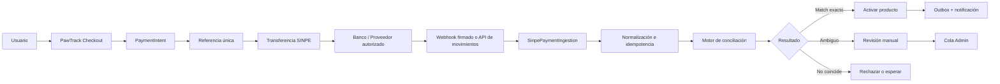

# Automatización de pagos SINPE Móvil — PawTrack CR

**Estado actual:** conciliación manual con referencia única  
**Fecha:** 2026-09-06  
**Objetivo futuro:** verificar automáticamente las transferencias SINPE y activar el producto correcto sin intervención manual, con trazabilidad financiera y controles antifraude de nivel enterprise.

---

## 1. Estado actual del flujo

PawTrack genera una referencia única de 8 caracteres alfanuméricos para cada operación de pago. La referencia se almacena en la suscripción, pedido de tienda, bundle o recompensa correspondiente.

El usuario debe:

1. Iniciar el proceso de compra.
2. Recibir la referencia, por ejemplo `ABC12345`.
3. Realizar la transferencia SINPE Móvil al número configurado por PawTrack.
4. Escribir `ABC12345` exactamente en el **asunto o descripción/mensaje de la transferencia**, según el nombre que utilice la aplicación bancaria.
5. Regresar a PawTrack y presionar **Ya realicé el pago SINPE**.

Actualmente el sistema solo registra el aviso del usuario. Un administrador revisa la cuenta bancaria y activa manualmente la suscripción o confirma el pedido.

### Importante

- La referencia no es una prueba automática de pago.
- `PaymentReported` significa que el usuario declaró haber pagado; no significa que el banco haya confirmado el depósito.
- No se debe activar una suscripción únicamente porque el usuario haya presionado el botón de aviso.
- La cuenta receptora, monto, moneda, fecha, referencia y estado deben verificarse antes de liberar el producto.

---

## 2. Objetivos de la automatización

La automatización futura debe:

- Detectar transferencias recibidas.
- Extraer referencia, monto, fecha, cuenta origen y cuenta destino cuando el proveedor lo permita.
- Relacionar la transferencia con una operación PawTrack.
- Verificar monto, moneda, ventana temporal y estado.
- Evitar duplicados y replay attacks.
- Activar automáticamente solo cuando todas las reglas pasen.
- Enviar a revisión manual los casos ambiguos.
- Mantener auditoría inmutable de cada decisión.
- Permitir conciliación y reversión administrativa.
- Funcionar de forma idempotente ante reintentos, webhooks duplicados o caídas parciales.

---

## 3. Restricción fundamental: SINPE no implica una API pública universal

Antes de implementar código, PawTrack debe confirmar con el banco receptor y el proveedor de servicios financieros:

- Si existe API oficial para consultar transacciones entrantes.
- Si existe webhook firmado para notificar depósitos.
- Qué campos están disponibles: referencia, concepto, monto, fecha, cuenta destino, cuenta origen y estado.
- Si la API permite consultar movimientos por rango de tiempo.
- Cómo se autentica la integración: mTLS, OAuth 2.0, certificados, API keys o firma HMAC.
- Límites de consulta, SLA, retención y soporte.
- Reglas de protección de datos y obligaciones regulatorias.

No se debe automatizar leyendo HTML del portal bancario, usando scraping, credenciales personales, capturas de pantalla o procesos que violen los términos del banco. Si el banco no ofrece una integración autorizada, el fallback enterprise es importar estados de cuenta firmados o archivos oficiales y procesarlos de forma controlada.

---

## 4. Arquitectura objetivo



### Componentes

#### 4.1 PaymentIntent

Crear una entidad independiente de la suscripción final:

- `Id` GUID v7.
- `Reference` única de 8 caracteres.
- `UserId` o sujeto comprador.
- `ProductType`: `Subscription`, `StoreOrder`, `Bundle`, `Bounty`.
- `ProductId`.
- `PlanId` y `PlanVersion`, cuando corresponda.
- `ExpectedAmountCrc`.
- `CurrencyCode`.
- `ExpectedRecipientAccountId`.
- `BillingInterval`.
- `Status`.
- `ExpiresAt`.
- `CreatedAt`, `UpdatedAt`.
- `CorrelationId`.

Estados recomendados:

```text
Created
AwaitingPayment
UserReported
ProviderReceived
Matched
Confirmed
Rejected
Expired
RefundPending
Refunded
ManualReview
```

La referencia debe tener un índice único. Una referencia no debe reutilizarse, aunque el pago expire o sea rechazado.

#### 4.2 SinpeTransaction

Representa el movimiento recibido desde el banco o proveedor:

- `ProviderTransactionId` único.
- `ProviderName`.
- `ReferenceRaw`.
- `ReferenceNormalized`.
- `AmountCrc`.
- `CurrencyCode`.
- `ReceivedAt`.
- `ValueDate`.
- `SenderAccountFingerprint`, nunca la cuenta completa si no es necesaria.
- `RecipientAccountId`.
- `RawPayloadHash`.
- `SignatureVerified`.
- `ProcessingStatus`.
- `CreatedAt`.

No se debe guardar el payload bancario completo sin una política de retención y clasificación de datos.

#### 4.3 ReconciliationResult

Registrar la decisión del motor:

- `PaymentIntentId`.
- `SinpeTransactionId`.
- `MatchType`: `Exact`, `AmountOnly`, `ReferenceOnly`, `Ambiguous`, `Rejected`.
- `Confidence`.
- `Reasons`.
- `RulesVersion`.
- `DecidedAt`.
- `DecidedBy`: `System` o ID de administrador.

---

## 5. Reglas de conciliación

El motor debe aplicar reglas deterministas y auditables.

### 5.1 Match automático recomendado

Activar automáticamente solo si se cumple todo:

1. La firma del webhook o la autenticidad de la consulta fue verificada.
2. El `ProviderTransactionId` no fue procesado anteriormente.
3. La cuenta destino coincide con una cuenta receptora activa de PawTrack.
4. La referencia normalizada coincide exactamente con un `PaymentIntent` abierto.
5. El monto coincide con `ExpectedAmountCrc`.
6. La moneda coincide con `CRC`.
7. La transacción está dentro de la ventana permitida, por ejemplo desde la creación hasta 72 horas después de `ExpiresAt`.
8. El `PaymentIntent` no está confirmado, rechazado, reembolsado o expirado.
9. No existe otra transacción confirmada para el mismo `PaymentIntent`.

### 5.2 Casos de revisión manual

Enviar a `ManualReview` cuando:

- La referencia tiene errores de digitación.
- El monto es diferente.
- Hay dos operaciones abiertas con referencias similares.
- El depósito llegó a otra cuenta receptora.
- La transferencia está duplicada.
- El pago llegó fuera de la ventana.
- El proveedor devolvió información incompleta.
- El producto requiere revisión comercial o legal.

Nunca hacer fuzzy matching de referencia sin guardar la razón, el umbral y la aprobación explícita de un administrador.

### 5.3 Normalización de referencia

Normalizar solo para búsqueda técnica, conservando siempre el valor original:

- Trim de espacios iniciales y finales.
- Convertir a mayúsculas.
- Eliminar separadores permitidos como espacios o guiones solo si el banco confirma que pueden aparecer.
- No sustituir caracteres ambiguos (`O/0`, `I/1`) automáticamente para activar pagos.
- Comparar la referencia normalizada con la referencia canónica.

---

## 6. Flujo de webhook

### 6.1 Recepción

1. El endpoint recibe el evento.
2. Verifica firma, timestamp y nonce.
3. Rechaza eventos demasiado antiguos.
4. Guarda el evento original mínimo o su hash para auditoría.
5. Usa `ProviderTransactionId` como clave de idempotencia.
6. Responde rápidamente al proveedor con `2xx` solo después de persistir el evento durablemente.
7. Procesa la conciliación en background mediante outbox o cola.

Endpoint futuro sugerido:

```text
POST /api/webhooks/payments/{provider}
```

Protecciones obligatorias:

- HTTPS solamente.
- Validación de firma HMAC o mTLS.
- Rate limiting.
- Allowlist de IP solo como capa adicional, nunca como única autenticación.
- Replay protection con timestamp y nonce.
- Body size limit.
- Correlation ID.
- No devolver detalles sensibles en errores.

### 6.2 Idempotencia

El mismo evento puede llegar varias veces. El procesamiento debe ser seguro:

```text
if ProviderTransactionId already exists:
    return previously recorded processing result

insert transaction with unique key
publish reconciliation command once
```

El cambio de estado y la activación del producto deben ocurrir en una transacción o mediante outbox transaccional. Nunca activar primero y registrar el evento después.

---

## 7. Flujo de polling cuando no existe webhook

Si el proveedor solo ofrece consulta de movimientos:

1. Job cada 1 a 5 minutos, según límites del proveedor.
2. Consultar una ventana solapada, por ejemplo últimos 15 minutos.
3. Usar cursor o `ProviderTransactionId` para no perder movimientos.
4. Persistir cada movimiento de forma idempotente.
5. Conciliar en background.
6. Reintentar con backoff exponencial y jitter.
7. Alertar si el cursor no avanza o la cuenta no responde.

El polling no debe ejecutarse dentro de una request HTTP ni bloquear la activación manual.

---

## 8. Integración con los módulos actuales

### Suscripciones

La creación debe producir un `PaymentIntent` antes de mostrar la referencia. El intent debe guardar:

- `PlanId`.
- `PlanVersion`.
- `BillingInterval`.
- Precio calculado server-side.
- Vigencia esperada.

Al confirmar el pago:

1. Marcar `PaymentIntent = Confirmed`.
2. Activar la suscripción con el precio y plan snapshot.
3. Aplicar sincronizaciones de clínica, tienda o municipalidad.
4. Publicar notificación de activación por outbox.
5. Registrar auditoría.

### Pedidos de tienda

El pedido ya contiene `PaymentReference`, pero debe evolucionar a `PaymentIntentId`. El total debe quedar congelado en el pedido y no recalcularse desde el catálogo después de la compra.

Al confirmar:

- `PaymentIntent = Confirmed`.
- Pedido pasa de `PaymentReported` a `Confirmed`.
- La tienda recibe notificación.

### Bundles

El bundle debe generar un `PaymentIntent` propio y guardar snapshot del bundle, precio y componente de suscripción incluido. No debe depender de diccionarios duplicados en frontend y backend.

### Bounties

Los depósitos de recompensas requieren un flujo separado, con estados y reglas propios. No se deben mezclar automáticamente con pagos de suscripciones o pedidos aunque todos usen SINPE.

---

## 9. Contratos API futuros

### Crear intención de pago

```http
POST /api/payment-intents
Authorization: Bearer <jwt>
Content-Type: application/json

{
  "productType": "Subscription",
  "planId": "<guid>",
  "billingInterval": "Monthly"
}
```

Respuesta:

```json
{
  "id": "<guid>",
  "reference": "ABC12345",
  "amountCrc": 2990,
  "currency": "CRC",
  "recipient": "7000-0000",
  "expiresAt": "2026-09-09T20:00:00Z",
  "status": "AwaitingPayment"
}
```

### Reportar pago del usuario

```http
POST /api/payment-intents/{id}/report
Authorization: Bearer <jwt>
```

Esto solo debe cambiar el estado a `UserReported`; no debe confirmar el pago automáticamente.

### Estado del pago

```http
GET /api/payment-intents/{id}
Authorization: Bearer <jwt>
```

El usuario solo debe ver datos de su propio intent.

### Revisión administrativa

```http
GET /api/admin/payment-reconciliation?status=ManualReview
POST /api/admin/payment-reconciliation/{id}/confirm
POST /api/admin/payment-reconciliation/{id}/reject
```

Todos los endpoints administrativos deben exigir rol `Admin`, registrar auditoría y requerir motivo para rechazo o confirmación manual.

---

## 10. Seguridad y cumplimiento

- No almacenar credenciales bancarias en PawTrack.
- Mantener secretos y certificados en Azure Key Vault.
- Rotar credenciales del proveedor.
- Aplicar mínimo privilegio a la identidad que consume la API bancaria.
- Cifrar datos sensibles en tránsito y reposo.
- Enmascarar cuentas de origen en UI y logs.
- No escribir payloads bancarios completos en logs de aplicación.
- Aplicar retención y eliminación de datos según política de privacidad.
- Registrar quién confirmó, rechazó o reabrió una conciliación.
- Separar roles operativos y financieros cuando el volumen lo justifique.
- Requerir doble aprobación para reembolsos o ajustes manuales de alto valor.
- Implementar límites diarios y alertas de anomalías.

---

## 11. Observabilidad enterprise

Métricas recomendadas:

- Pagos recibidos por hora.
- Porcentaje de matches automáticos.
- Porcentaje de revisiones manuales.
- Tiempo desde recepción hasta conciliación.
- Tiempo desde conciliación hasta activación.
- Duplicados detectados.
- Montos rechazados por diferencia.
- Eventos con firma inválida.
- Errores del proveedor.
- Edad del pago más antiguo en `ManualReview`.

Alertas:

- No llegan movimientos durante una ventana esperada.
- Aumentan las firmas inválidas.
- El porcentaje de pagos ambiguos supera el umbral.
- El job de polling no avanza.
- Hay activaciones sin `ReconciliationResult`.
- Hay transacciones confirmadas sin producto activado.

Todos los logs deben incluir `CorrelationId`, `PaymentIntentId` y `ProviderTransactionId` cuando existan.

---

## 12. Plan de implementación por fases

### Fase 0 — Confirmación comercial y bancaria

- Confirmar proveedor/banco con API autorizada.
- Obtener documentación técnica, sandbox y límites.
- Confirmar campos de referencia y estados.
- Confirmar responsabilidades legales y soporte.
- Definir cuentas receptoras y reglas de moneda.

**Salida:** contrato firmado y documentación de integración.

### Fase 1 — Modelo interno y snapshots

- Crear `PaymentIntent`.
- Crear `SinpeTransaction`.
- Crear `ReconciliationResult`.
- Añadir `PlanId`, `PlanVersion`, `BillingInterval` y precio snapshot a suscripciones.
- Migrar pedidos y bundles a `PaymentIntentId`.
- Mantener compatibilidad temporal con `PaymentReference`.

**Salida:** migración aplicada y pruebas de dominio.

### Fase 2 — Integración sandbox

- Implementar cliente del proveedor con `HttpClientFactory`.
- Timeout, retry y circuit breaker controlados.
- Verificación de firma.
- Webhook o polling en ambiente sandbox.
- Persistencia idempotente.

**Salida:** eventos sandbox procesados sin duplicados.

### Fase 3 — Motor de conciliación

- Implementar reglas exactas.
- Añadir cola de `ManualReview`.
- Registrar razones y versión de reglas.
- Pruebas de montos, referencias, duplicados, expirados y pagos tardíos.

**Salida:** decisiones reproducibles y auditables.

### Fase 4 — Activación transaccional

- Integrar confirmación con suscripciones y pedidos.
- Usar outbox para notificaciones.
- Garantizar que la activación sea idempotente.
- Implementar compensación si falla la activación después de confirmar el pago.

**Salida:** no existen pagos confirmados sin estado de negocio consistente.

### Fase 5 — Producción controlada

- Feature flag para activar automatización por cuenta o porcentaje.
- Shadow mode: comparar decisiones automáticas con revisión humana sin activar todavía.
- Activación parcial con límites monetarios.
- Revisión diaria de métricas durante el periodo inicial.
- Plan de rollback a conciliación manual.

**Salida:** automatización habilitada con evidencia operativa.

### Fase 6 — Operación continua

- Conciliación diaria contra estado bancario.
- Reporte de diferencias.
- Rotación de secretos y certificados.
- Revisión de reglas y falsos positivos.
- Pruebas de recuperación ante fallos.
- Auditoría periódica de accesos administrativos.

---

## 13. Criterios de aceptación

La automatización estará lista para producción cuando:

- Cada pago confirmado tenga una transacción del proveedor asociada.
- Cada transacción procesada sea idempotente.
- No sea posible activar dos veces el mismo `PaymentIntent`.
- Los pagos con monto incorrecto nunca se autoactiven.
- Los pagos ambiguos lleguen a revisión manual.
- Exista trazabilidad completa desde transferencia hasta producto activado.
- Los webhooks con firma inválida sean rechazados y alertados.
- Los reintentos y caídas no produzcan dobles activaciones.
- Exista rollback operativo a modo manual.
- Las pruebas unitarias, integración, seguridad y carga estén aprobadas.
- Finanzas pueda exportar conciliaciones y diferencias.

---

## 14. Decisiones pendientes

- Banco/proveedor autorizado para la integración.
- Webhook contra polling.
- Ventana de expiración de referencias.
- Política para pagos con referencia errónea.
- Política para pagos parciales o excedentes.
- Proceso de reembolso.
- Cuenta receptora única o múltiples cuentas por producto.
- Separación de funciones entre soporte, operaciones y finanzas.
- Tratamiento fiscal y generación de comprobantes.
- Retención de datos bancarios y evidencias de conciliación.
